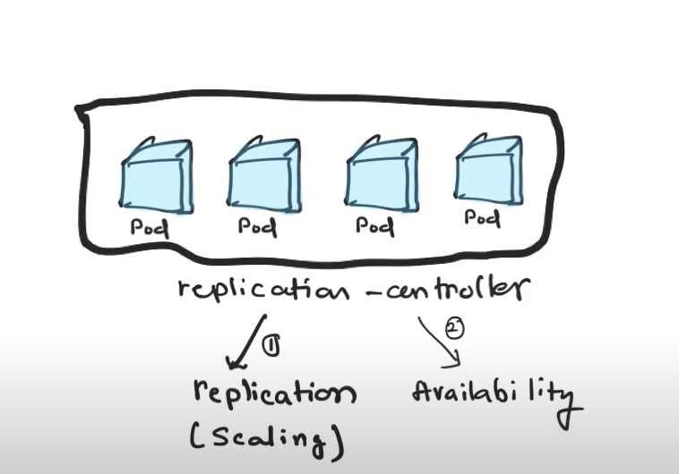

**Pods and nodes are both fundamental concepts in the Kubernetes architecture**, but they serve different purposes.

**A pod is the smallest deployable unit in Kubernetes, representing a single instance of a running process in a cluster**. A pod can contain **one or more tightly-coupled containers that share the same network namespace and storage volumes**. All containers in a pod **run on the same node, and they can communicate with each other using local host networking**.

Nodes, on the other hand, are the **physical or virtual machines that make up a Kubernetes cluster**. Nodes run the Kubernetes control plane components, as well as the container runtime (such as Docker), and they provide the **computational resources necessary to run the workloads deployed in the cluster**.
Here are some of the key differences between pods and nodes:

- **Scale**: Pods are designed to scale up and down quickly in response to changes in demand, while nodes are relatively static and have a fixed amount of resources.

- **Isolation**: Pods provide a level of isolation between running processes, allowing them to share the same network namespace and storage volumes, while nodes provide a higher level of isolation by running different containers and workloads in separate environments.

- **Management**: Pods are managed by Kubernetes controllers, which ensure that the desired number of pod replicas are running at all times, while nodes are managed by the kubelet agent, which ensures that the node is healthy and has the necessary resources to run the assigned workloads.

- **Networking**: Pods have a unique IP address and can communicate with other pods in the same cluster using local host networking, while nodes have a network interface and can communicate with other nodes and external networks.

In summary, pods and nodes are both essential components of the Kubernetes architecture, but they serve different purposes. Pods are the smallest unit of deployment and provide a level of isolation between running processes, while nodes are the physical or virtual machines that provide the computational resources necessary to run the workloads deployed in the cluster.

## Pods vs Deployments vs Services

1. Pods:

- A pod is the smallest unit of deployment in Kubernetes. It represents a single instance of a running process or workload. Pods are typically ephemeral and can be created, scheduled, and destroyed dynamically. A pod can contain one or more containers that are tightly coupled and share resources, such as network and storage volumes.

2. Deployments:

- Deployments provide a declarative way to manage and update application replicas in Kubernetes. They ensure that a specified number of replicas (pods) are running and handle rolling updates and rollbacks of application versions. Deployments also provide features like scaling, scaling policies, and easy management of application replicas.

3. Services:

- Services define a stable endpoint (IP address and port) that enables network connectivity to a set of pods. They allow pods to communicate with each other within the cluster and provide a way to expose the application outside the cluster. Services enable load balancing and service discovery, allowing other components to access the application without needing to know the individual pod IP addresses.

Relation between them -

- Pods are the actual running instances of your application or workload.
- Deployments manage and control the desired state of your application by defining how many replicas (pods) should be running and handling updates.
- Services provide a stable network endpoint for accessing your application or connecting to other pods within the cluster.


## Pod vs Container

A pod is a **higher-level abstraction** that represents a **group of co-located containers** and provides a shared environment for them to run together. Containers, on the other hand, are the **individual runtime environments** that encapsulate and execute the application code and dependencies. **Pods allow for the coordination and management of multiple containers**, while **containers provide the isolation and execution environment** for the application code.

Important Points -

- **Pod represents logical group of containers sharing same resources and co-located in same host**
- Containers within a pod are scheduled and run together on the same node
- **Pods provide a way to manage and orchestrate the lifecycle of multiple containers as a single entity.**
- **Containers in pod share same NETWORK NAMESPACE** and communicate via **localhost**
- Pods are **ephemeral** and can be **created, scheduled, and destroyed dynamically**.

---

## Tasks of Replication Controller

**Replication controller are part of deployments mentioned in below headings**



A replication controller has mainly 2 tasks-

- do replication for horizontal scaling
- Maitain availability through replication(if a pod goes down, replication controller must bring it back by taling to scheduler and launching new pod)


After replication and maintaining HA(High availability) you want may want to go from 1 version to another.

**In order to deploy another version, you may want to define a STRATEGY. In kubernetes environment this could be rolling updates/batch updates or Recreate**(you set up a down time and create a new version)

## Sending Traffic to Pods

**Services are used to send traffic to pods** and they **act like a load balancer** where they **accept traffic from a certain port** and sends to **backend pods** and this is concept of **services**.
These multiple pods behind **load balancer is for high availability and scalability** via **replication**.

Multiple instances of application are deployed in machines and all those are behind a load balancer via single end point. **Load balancer is used to distribute these incoming requests efficiently**

The way you distribute traffic among all available pods is defined in service.

**Every service has an IP and DNS(or name)** associated to it.


## Service Discovery

**Services** also offer you with service discovery.

When one application wants to connect to another application, it is done through a **common endpoint** and behind the services would be the pods.
This service is exposed with DNS so it can connect with the name.
This **naming or service discovery is another thing provided by services**.


---

When you deploy applications, you typically need **deployments** and **services**.

**Deployment in turn will manage the replication controller**

**Replication Controller are part of deployments**

For a 2 tier application, you would create a **deployment** and a **service** for your **frontend as well as DB** and those are **minimum objects** to be created when starting deploying your app.

---

## Understanding Pods and Deployments

### Pods

Pods are collection of containers co-located, sharing same localhost **network** and **resources**. The main use of having multiple containers in same pod is that they all **schedule at same time**. Their use case arises when we want **close coupling of containers or resource sharing between containers**.

Pods provide **closer collaboration and resource sharing** between components while deployments provide **higher level control and management for scaling, updating and controlling lifecycle of pods**.

Combination of **pods** and **deployments** offers flexibility in managing individual containers and groups of containers as part of larger application.

### Deployments

They are mainly used to for **high availability** and **scaling** as they use **replica sets** under the hood.
They are used to manage and control lifecycle of pods.

- They increase/decrease the number of replicas of pods by horizontal scaling and maintain HA(high availability)
- It supports **rolling updates** to roll updates **without downtime**. Deployments create new pods with updated version and gradually replace existing pods. If issue arises, deployments provide **roll-back ability** to previous version.
- Deployment **manages state of applciation and makes adjustments to match desired state**. If pods go **unavailable**, deployment controller automatically replaces them to maintain desired state.

**Deployments exist as a resource within Kubernetes API server as part of control pane and management of deployments are handled by kube-controller-manager**. They are used to manage **desired state** of **set of pods**.

Deployments are part of API group **app/v1** and are managed by **kube-controller-manager**.

**Deployment controller** is one of the controllers managed by kube-controller-manager. Deployments, **managed** by the **deployment controller**, are responsible for **creating** and **updating pods on the nodes**.
Nodes receive instructions from the deployment controller and create or modify pods accordingly.

---

## Services

**Services expose and access group of pods as single, stable network endpoint**. Service define **logical grouping of pods**.
They enable **communication** and **load balancing** across pods, abstracting away underlying IPs and provide **consistent way to access them**.

In this we do not have to worry about different IPs of different pods as service takes care of it. Requests come to Service(load balancer) on specified port of YAML file and sends requests directly to pods. We have to send request to the Service port and domain only.

Services exist as **resource** within **Kubernetes API server** that define **logical set of pods** and **policy to access them**. They are part of **v1** API(like deployments) and are managed by **kube-controller manager**.

**Services** act as **load balancer** and provide **stable network endpoint(virtual IP)** to access pods in consistent manner, regardless of underlying pod IPs and scaling.

Kube-controller manager has **service controller** which matches desired state from actual by configuring **network routing** and **load balancing**.

**Service controller regularly queries kubernetes API server to discover pods that match service selector**.

**It retrieves the pod IP addresses and ports and updates the endpoints associated with the service accordingly.**

**Traffic received at the service IP and port is load-balanced across the available endpoints (pods) based on the configured load-balancing algorithm.**

By using services, you abstract away complexities of managing individual IPs and provide **consistent network endpoint** for accessing group of pods.

---

### Deployment and Service relation

A deployment manages set of identical pods ensuring desired number of replicas are running and handling updates and scaling. These pods are associated with same replica set.

On the other hand, a service provides a stable network endpoint to access a group of pods. Services define a logical grouping of pods based on labels and selectors. The pods included in a service are determined by the selector specified in the service definition.

While it is common for services to target pods that are managed by a deployment, they are separate resources and have different responsibilities. You need to explicitly **configure the service's selector to match the labels assigned to the pods created by the deployment if you want them to be part of the same service**.

By **linking the deployment and service together using matching labels and selectors, you can ensure that the pods created by the deployment are included as endpoints in the service**, allowing them to be accessed through the service's stable network endpoint.

Example of deployment with service selector for pods to be part of same service.

**Deployment.yaml**

```yml
apiVersion: apps/v1
kind: Deployment
metadata:
  name: my-deployment
spec:
  replicas: 3
  selector:
    matchLabels:
      app: my-app
  template:
    metadata:
      labels:
        app: my-app
    spec:
      containers:
        - name: my-container
          image: my-image
          ports:
            - containerPort: 8080
```

here label `app: my-app` is for it's pods. The `selector` field specifies labels to match for selecting pods.

**Service.yaml**

```yml
apiVersion: v1
kind: Service
metadata:
  name: my-service
spec:
  selector:
    app: my-app
  ports:
    - protocol: TCP
      port: 80
      targetPort: 8080
```

here we have the same selector `app: my-app` mentioned as label meaning they are included as endpoints of service `my-service`. The traffic of this service will route to pods managed by `my-deployment` based on **selector match**

## Service Discovery

It refers to clients(such as **pods, external users**) to **dynamically** discover and access services **within** the **cluster**. It enables seamless communication between **various components of an application** without the need to **hardcode IP addresses or endpoints**.
Ways to achieve -

- **DNS-Based Service Discovery** - It allows services to be discovered by **names**. **Each service is assigned DNS name based on it's name and namespace**.
- **Environment Variables** - **Kubernetes automatically sets environment variables for each container within a pod, allowing them to discover services running within the SAME namespace.**
- **Service Discovering Libraries** - Various libraries and client side SDKs provide programmatic access to service discovery within kubernetes. They provide additional things like health checking and failover mechanisms. Example: **Consul**, **etcd** and Istio. (**Consul** here in biz2 used for maintaining env variables only)

---

## Service Mesh

TODO

## Replicasets

- Run multiple instances of pods
- make sure set number of pods run all the time
- **shares load of traffic among pods**
- spans across multiple nodes

Why Deployment better?

- Provides additional capabilities like **rolling out** of changes and **rollback**
- Perform rollout with **strategy**(max_surge, max_unavailable)(V1RollingUpdateDeployment)

## Static Pods (Important)

Reference - https://kubernetes.io/docs/tasks/configure-pod-container/static-pod/

Static Pods are **managed** directly by the **kubelet** daemon on a **specific node**, **without the API server observing them**. Unlike Pods that are managed by the control plane (for example, a Deployment); instead, the **kubelet watches each static Pod** (and restarts it if it fails).

Tasks -

- Create a static pod on specific node
- Delete a running static pod(cannot delete by just delete command)
- Move static pod from master to worker

- Go to node
- Run `ps aux | grep kubelet`
- Find the **config.yaml** file
- `cat config.yaml` and find the line which says **staticPodPath**
- Go to the path and create a **pod yaml** file
- Save and then do `kubectl get pod`. it will create a static pod
- Deleting the file will delete the pod as well

## Pod Deletion Steps (Graceful and recommended)

`kubectl delete pod pname`

- First the command is entered in the terminal via kubectl
- kubectl interacts with API server to send delete request(using k8s api)
- request is validated(authorized or not) via credentials(cert) or rbac
- Pod deletion request processes. API server first **processed pod deletion request and updates the desired state od pod as terminated**. It does **NOT immediately delete pod but marks pod for deletion**
- kube Controller manager **detects desired state of pod gets changed**. It **manages and monitors state**.
- Scheduler comes into play. If pod is part of deployment, it will create replacement pod to maintain desired replicas
- kubelet termination at worker node. The correct node kubelet recieves the desired state and then kubelet starts **termination for containers of the pod**. It sends termination signal to container in pod allowing to perform any necessary cleanup and graceful shutdown and **take time to handle gracefully**. Next step occurs if container not stopped.
- Termination timeout - if container does not respond within specified timeout, kubelet sends **SIGKILL** to forcefully stop container
- Pod cleanup - Once all containers in pod terminated or forcefully stopped, kubelet updates pod status as **terminated** and **removes pod network namespace associated and resources to pod**
- API server update happens that pod has been successfully terminated
- API server then updates to kubelet where kubectl command was run to give the response of actions(kubectl feedback) to confirm deletion


## Pod Deletion (forceful)

Does not allow to gracefully stop. It sends `SIGKILL` command directly to forcefully stop container and delete pod.

`kubectl delete pod pname --force`

- Forceful deletion request sent to API server
- Request validated at API server for auth
- Immediate termination request(`SIGKILL` - bad way to stop) to all container within pod to stop containers without perform cleanup/shutdown/termination. Controller and scheduler do not come in this picture as forceful
- Pod cleanup occurs where network namespace and resources de-allocated, updates pod status to terminated
- API server update occurs after cleanup, informed by kubelet
- API server updates kubectl feedback. Response sent to kubectl tool to send the message
