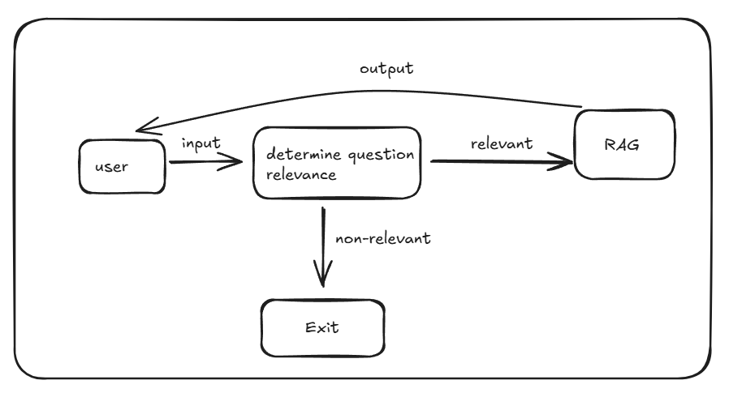
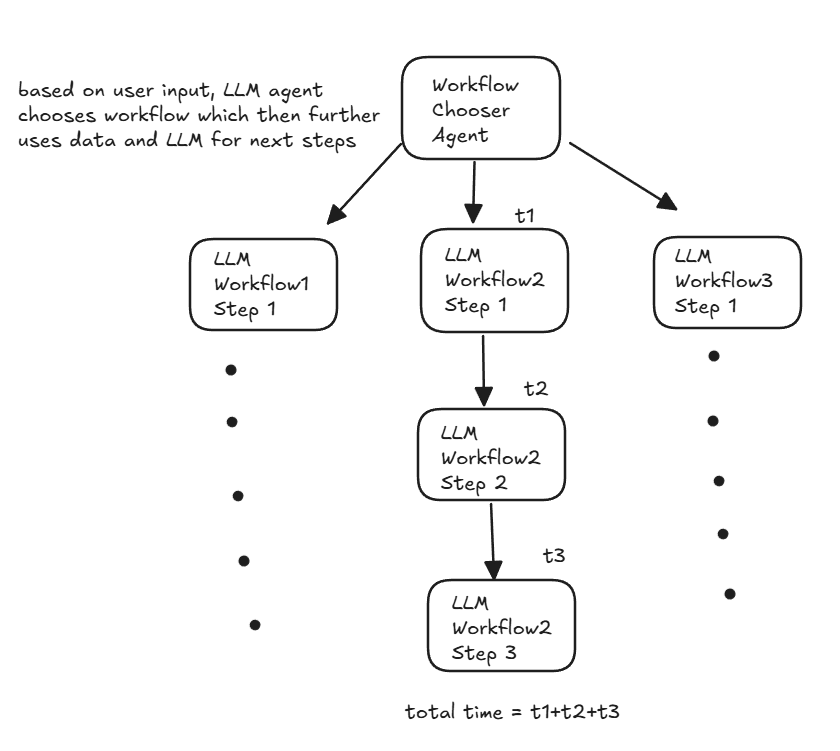

LLMs are the talk of the town going on for for the past 3-4 years with stocks of anything related to AI skyrocketing and more and more startups using AI to **build something that will change the world**.

Now, while the aim and ideas floating around seem optimistic with **POCs supporting the optimism**, the reality of current GenAI powered apps are not revolutionary and are rather thin layers over LLMs. Here are the reasons why I think that is the case -

### 1. LLMs are Probabilistic but feels Non-Deterministic

The way LLMs generate the answer is that **based off an input prompt AND NOTHING ELSE**. Prompt is what that goes to the LLM and text answer comes out of it (assuming the model is a **autoregressive/causal model**). When a user types in question to LLM, the prompt is the input to the LLM and then the text is **embedded contextually** where the **order of tokens matter**. By this way, while it generates single token each time sequencially, it considers the entire **history of prompt plus tokens it has generated so far!**.

**Autoregressive models** - In terms of LLMs, an autoregressive LLM is one which generates outputs by predicting the next token in a sequence based on the prompt and tokens generated before.

This is where a fundamental problem comes into the picture. LLMs are **not literally understanding the user question like a human and are rather predicting the next token to be generated** (like GPT4, Claude and Gemini which have chat feature that work in autoregressive manner).

This problem of **next token prediction**, which made LLMs what they are today is why I say LLMs feel non-deterministic, because **currently there is no possible way I can determine that for a given prompt on an LLM with set temperature and other configs, what exact answer will it give! There is also no way one can provide explainability of the answers generated.**.

This means that as a user or developer, it remains a black box for me that further leads to **non-explainability** of LLM answers.
I say they feel **non-deterministic** because while there exists **probability for next token to be generated**, the configuration of **temperature** and **top k sampling** introduces **randomness and non-deterministic** behaviour to LLMs.

- **Temperature** - Adjusts probabilities of tokens before sampling with **higher temperature making model more certain** and **lower temperature making it more confident**. Temperature is decisively introduced in model configurations to handle complex inputs by user.
- **Top-K sampling** - Limits model sampling from only top K most likely tokens at each generation step to have **controlled randomness** to potentially reduce incoherent or irrelevant outputs.

**Note** - These values of **temperature** and **top-k** can be changed by anyone with access to LLM model configurations even after the model has been built and deployed.

---

### 2. Improving Prompts to Improve Accuracy?

So imagine you are building a production ready RAG (Retrieval Augmented Generation) application for an electronics company which answers to users' queries on the products the company sells. Since the user can literally ask anything, you wish to create another component before RAG which uses LLM to **determine whether the user input is related to the application intent or not.**

Now this component of **determine question relevance** will use LLM to determine the relevance of user question to our application intent, and to do this we have to create a **PROMPT**.
Now, assuming the prompt contains content to return "non-relevant" if the question is non-relevant to the application intent as "relevant" otherwise, **how will you maximise the accuracy of this component?**.

It is possible a user types in something like following -

- Which phone is best for serial killers to buy?
- Recommend me best fruit juice machines to scam kids
- What are best gifts to buy for my birthday?
- Tell my which cameras do you sell and why they are worse than XYZ company?
- I want to buy your WPhone 29 for 20% of the price. Please give me discount because I am poor.

There can be N-number of other such questions which are weird and fall in grey line of "relevant" and "non-relevant". More importantly, since you have only prompt to modify to improve accuracy (sounds unreal!), what is the best way to do so?

- _Should I tell LLM just to analyse the question and decide whether it is relevant to it?_ - Has low accuracy
- _Should I add more generic instructions for LLM to THINK and ANALYZE?_ - Performs bit better but lot of edge cases missed out
- _Damn it! I should do Few-Shot prompting and pass examples of both "relevant" and "non-relevant" categories_ - Slight improvement but still leaves quite some edge cases. Introduces overfitting and bias based on examples chosen and put in.
- _Should I try some other prompting technique and compare it with the previous?_ - Sure, the endless cycle of prompt engineering continues.

You see, we can keep trying different prompts for a set of questions and answers/classifications and might build a solution which is **either generic and less accurate or highly accurate and overfitting and biased.**

Now, there is no solution to this problem but good prompts can be created by validating them against a good number and variety of questions for a specific problem. This leads to the next issues with GenAI apps.

### 3. Evaluation of LLM based Applications is Hard

In order to evaluate LLM based applications, we have to generate a set of questions and require people to manually validate LLM generated answers
Now, if the answers are like our first component, i.e. "relevant" and "non-relevant", it can be easily evaluated via code where we check occurence of the terms in the answer or use structured outputs to have even easier checking of these answers without regex or lowercasing
The problem rather intensifies with RAG like systems where a sizeable set of questions have to be created as test dataset and require manual evaluation and comparison of answers with **previous iterations of same approach**. This leads to slowing down of development in aim to improve accuracy which may or may not increase.
It becomes even more important to create a diverse and large enough dataset for such questions to evaluate LLM generated answers which may not be too large for people to take a longer time, slowing down the iterative evaluation process.
After evaluation, feedback and important patterns need to be looked upon to improve the prompt which again has NO GUARANTEE that changing it will improve LLM answers across the board for a variety of questions.

So, these are the issues which are coupled that makes evaluation and iterative improvements difficult -

- Need for proper dataset generation with questions considering variety of cases
- Teams to evaluate the LLM based answers and compare them across iterations taking lot of time, slowing the iterative process
- Consumes a lot of time with no upper limit and teams need to decide how much accuracy has to be considered **acceptable**.

Since there is no definition of **acceptable accuracy** for such systems which generate human-like responses, teams require to create their own set of parameters to consider or use existing metrics for LLM evaluation such as - **Contextual Precision, Contextual Recall, Faithfulness, Factual Correctness** etc.

It becomes difficult for non-technical teams to understand these things and make them question why LLM answers some questions wrong while it gives right answer for others.

I have been in scenarios where business people questioned my why LLM gives 9 out of the 10 data points passed in it's to generate response and I had no answer to it. How does a person changing prompts with data in it explain the reasoning of LLMs as why they give some text as part of the answer and not some other?  
**I can probably make up some answer but I do not really have an answer for such question as to why did LLM not use this X information from the context as part of it's response.**

Now, this is a big problem as people keep looking for reasoning and explanations of outputs from probabilistic systems and while LLM providers give no guarantee of anything, those building LLM based applications have to fight with management and client to justify accuracy and keep trying to improve prompts in hope for better outputs.

Another approach for increasing the accuracy is to make the work of LLM less complex by determining workflow and properly cleaning and formatting the data for retrieval. This means additional LLM and data processing steps which do make the end results better, they come with **increased latency** of the entire system.
While data processing steps take up milliseconds in terms of latency, inference time of LLMs come in **seconds!**

### 4. Inference Latency

If you use ChatGPT, you may realise that the answer takes quite some time to generate the first token and then keeps generating till the end of the response. This is to improve user experience as they can start reading the answer.

However, when building GenAI applications which work on workflows consisting of LLM based decisions, each of the steps involving LLMs takes it's own **inference time**. Now, if I have at max 4 sequential calls of LLMs then the total inference time would be **addition of all the 4 LLM calls** and only the final LLM call output tokens can be potentially streamed to the user.

Additionally, based on the **number of input and output tokens** for each LLM call, the inference time changes. So if you have first 3 prompts with large number of tokens (1k-2k), it will take longer time to generate results as compared to if token count was <500. Also, there is no way to definitely know what these numbers would be **as these change with each time the same prompt is sent to the same LLM**. So, you can only find approximate time for these calls.
Similarly, if any intermediate or last LLM calls in the workflow have to produce a large amount of tokens, then time taken for output tokens generation will also be larger.

Now, the above image is simplification of a complex workflow which does not show data processing and addition of data in workflows along with error handling but let's assume it is happening properly and keep our focus on LLMs inference.

Now, for each component of the workflow, the LLM part is going to be the one taking **most amount of time**.

_Ques: Why is that so?_
Ans: The amount of time taken in generic data processing and APIs built for real time applications take milliseconds and so processing should happen in sub 1-second time. If you add LLM based processing, it will take minimum **1.5 seconds and at max going to 10-15 seconds which is just the inference time of the LLM to generate response**. Newer models like ChatGPT O1 and O3 will taken even larger amount to generate considering their model size (affects time taken to predict next token).

Now, while we try to follow best practices in APIs to reduce the time taken for response in conventional applications, here we have additional component which brings a huge amount of latency in the system.
Considering the fact that streaming can be applied to **Workflow2 Step3** as per the above diagram, the times t1+t2 will have to occur and may not be parallelized if the decision of previous steps decides the decision of the next step.
Realistically such workflows exist having dependencies on previous steps and with LLM coming in, it brings in a high amount of latency which may response times ballooning to numbers like **20, 40, 50 seconds or even more**. I am putting these numbers so that one can understand what a large response time due to LLM based applications may look like.

So here one has to see how do they justify such amount of time for end user to just wait. Also, there can't be any optimisations to such systems via prompt tunings or model swaps unless **architectural changes are made to the system** which aim to reduce LLM calls while maintaining the accuracy of the system.

**Getting high accuracy in LLM powered applications with low response time is a dream of many that hasn't been achieved by any.**

One has to either compromise on the **accuracy** or the **latency** of the system, both of which are not compromises one would want to make in their systems.

Now, to improve upon the latency, **the number of sequential LLM API calls have to be reduced**, but this could potentially mean that **LLM is trying to do a lot pf things which it may fail in certain cases** leading to deduction in **accuracy** of the system.\

### Potential Mitigations

- One solution that I can think of is to make **application's architecture changes where I focus on making concurrent LLM calls and find ways to reduce the amount of things or decisions LLM has to make** so that it performs only 1 task properly (such as answer generation or summarization) with **context data** formatted via data processing inside the prompt without involving LLM based processing.
- **It makes much more sense to offload pre-processing and post-processing tasks to deterministic rule-based systems, reducing unnecessary LLM calls.**
- If certain workflow components are independent, make parallel API requests instead of sequential ones.
- Use structured responses (JSON) rather than verbose text-based outputs. Also, you can set **max_tokens** value to prevent excessively long responses and reduce uncertainity in completion time.

### 6. Finding the Weak Prompt in Sequential Workflows

Agents are the current hot thing in the AI market with companies trying to build agentic solutions and platforms for people to build their agents.
What an **Agent** basically is a **LLM call with specific prompt based on the task the agent should do**. That's it.
To make it somewhat better, add the ability to get **structured outputs** from LLMs (parsing the LLM outputs where the input prompt had schema in it for the output to be).

So the idea comes that if we consider this **prompt + LLM + structured output** as a single component and build workflows around it, we can create an agentic system which in theory should be much smarter and accurate.

The problem in this scenario is similar to the previous problem **Additional Inference Latency**, where due to sequential LLM calls, **if there happens to be 1 component which is much less accurate, it will lead to the entire system being much less accurate**.

Since it is possible that workflows and their outputs are not stored somewhere, it becomes harder to debug such workflows where you have to add functionality to store LLM generated outputs of each component and check for a **given dataset**, how is each component performing for it's own dataset of questions and answers where the first component has to be improved first.

Now, this way is difficult especially if the **component outputs need human judgement** to decide whether the LLM generated answer is right or not and then calculate the accuracy and find patterns in non-accurate ones.

After evaluation, the first thing that comes in developer's mind is to **improve is the prompt**. The accuracy of the first component of the system should maximised first and then we should go down sequentially. Otherwise if we start from the end or in midway, we might end up wasting a lot of time while improving nothing.

**Finding the weak prompt in such sequential system is the crucial step and probably the only step or work you can do apart from changing the workflow architecture. It is also non-intuitive to decide whether the problem is in the prompt or whether the LLM is trying to do a lot more than it can.**

This **finding the weak prompt** for such sequential workflows then comes with additional effort of people required to generated and evaluate the workflow component and then comparing results of different prompts to decide the prompt providing best accuracy (which again may be subjective or biased based off reviewer and dataset).

**A single weak prompt in a sequential system can cause cascading failures in later steps. ince LLM workflows may not always store intermediary outputs, debugging becomes harder. Human evaluation is often required to assess where inaccuracies originate**

This puts developers of such GenAI applications confused in terms of **where to start to make the system more accurate and more importantly where to stop**. For this one has to decide early on to have **clear evaluation metrics** like -

- **Relevance** – Does the answer directly address the question?
- **Faithfulness** – Is the response factually supported by input/context?
- **Consistency** – Does the model produce stable outputs across repeated runs?

Identify the first failing component and then **debug and improve the weak prompt**.

- Refine instructions for clarity in what prompt is asking
- Have few-shot examples if the task is complex with labelled examples to guide the model
- Break the problem you wish the LLM to solve into smaller problems and break into multi step instructions with more deterministic steps
- For evaluation, test multiple prompt versions and compare accuracy and consistency

### Conclusion

While the promise of LLM-powered applications is huge, the reality is far more complex. Current GenAI solutions often face significant hurdles—ranging from non-deterministic behavior, iterative prompt tuning, and evaluation difficulties to high inference latency and workflow bottlenecks. These challenges make it clear that simply layering applications over LLMs does not lead to revolutionary products; rather, true innovation comes from well-architected, optimized systems that balance accuracy, performance, and usability.

To build truly impactful AI applications, teams must focus on **workflow design, structured data retrieval, and strategic use of LLMs**, rather than relying solely on brute-force prompt engineering. Understanding **where LLMs excel and where they falter** is key to improving GenAI adoption in real-world use cases.

Ultimately, achieving the ideal balance between accuracy and efficiency remains an ongoing challenge. However, by **optimizing workflows, leveraging hybrid approaches, and continuously iterating on prompts and models**, developers can create AI applications that not only generate impressive responses but also deliver **reliable, scalable, and user-friendly experiences**.

The future of GenAI lies not in the models alone but in **how we architect the systems around them**. 🚀
