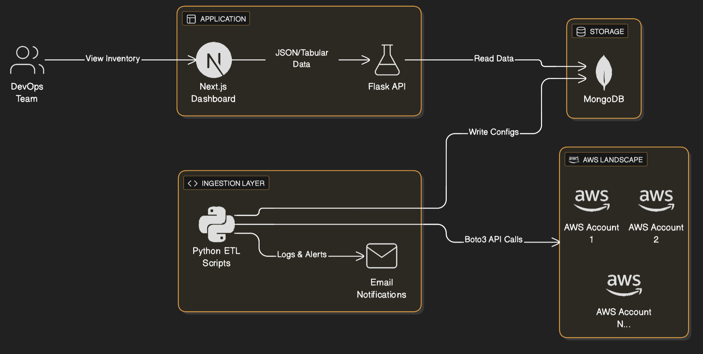
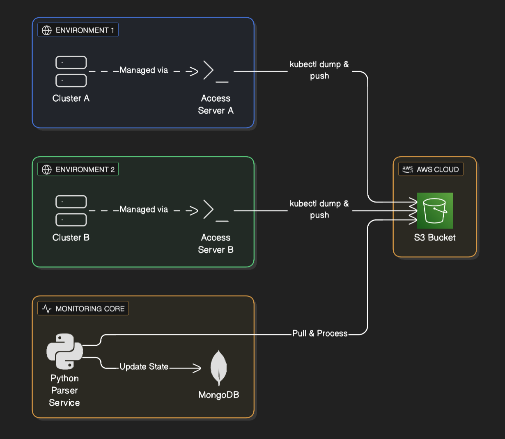
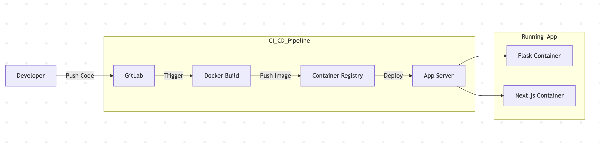

### Introduction

I was previously part of an organization with 500+ devs with more than 25+ AWS accounts for each client which had to be managed by the DevOps team. The number of people in DevOps team was smaller than the accounts and all of them were mostly active with resources being allocated and deallocated frequently. We utilised many AWS services like EC2, S3, EKS, SageMaker, RDS, Redshift, Cloudfront, Route53, SSM etc

If some compute or service has some error, the first step was to understand which AWS account has that resource failing. This required lot of inventory management to be done manually for DNS entries of different AWS accounts along with firewall and internal DNS entries. Versioning was hard and this process was time consuming.

The DevOps team was facing further common issues that could be solved faster - 

- The EC2 instances with application has stopped running and team needed details of any config change that could have let that happened. Also their CPU and RAM utilization can help debug issues as well
- See utilization of subnets and their CIDR block usage to decide allocation of clusters and instances to subnets with enough available IPs
- EKS and RDS cluster had nodes with configs whose information if retrieved can help simplify the process of debugging issues related to these services
- Route53 was crucial with DNS entries and the time taken to find the exact AWS account where the service is running can be minimized as well

These issues were pretty common in daily lives of the team and it could be solved via leveraging AWS SDK to fetch those information and view them in a centralized and consolidated manner.

I was suggested by my manager to utilise AWS SDK to fetch details of multiple services from a single account at start so we can atleast find running and stopped EC2 instances and their configurations being sent via mail to the DevOps team.

This required me to first think in terms of the way data will be stored inside the database. I chose NoSQL database MongoDB as JSON data was being sent by the Boto3 calls. Now I knew that **fetching data for each service would be done for single account at a time and this time has to be minimized**. There will be support for APIs to fetch all data of all accounts' and regions for a service as well, but the main thing was that reads had to be made faster.

So I wrote batch data pipelines with retries and proper logging for each AWS service to use Boto3 SDK to fetch configuration data for the services and populate the MongoDB database periodically (like cron jobs). I implemented indexing on fields to be used for search later. Configuration files were created to maintain the AWS account details and their IAM keys, as roles could not be used from a single machine running in a single account (IAM roles are account-based, and IAM keys were simpler to use and manage for this cross-account setup for MVP. Later it was switched to cross account IAM roles).

### System Architecture

To make this data accessible and useful for the entire team, I built a full-stack solution:

*   **Data Ingestion Layer**: Python scripts using `boto3` to fetch data from 25+ AWS accounts. Each script handled **pagination** (to fetch all resources) and **rate limiting** (to avoid throttling errors from AWS APIs).
*   **Database**: **MongoDB** was chosen for its schema flexibility, allowing us to store diverse configuration JSONs from EC2, RDS, S3, etc., without rigid schema constraints.
*   **Backend API**: A **Flask** application provided APIs to query this data. It included authentication libraries to ensure secure access.
*   **Frontend Dashboard**: A **Next.js (React)** application served as the user interface. It displayed data in a tabular format, dynamic headers based on resource types, and search capabilities.
*   **Alerting**: The ingestion scripts included error handling that triggered **email notifications** on failures, ensuring we knew immediately if data was stale.

#### Code Snippet Example for AWS SDK

```py
# Mock code
import boto3
from botocore.exceptions import ClientError

def fetch_ec2_inventory(access_key, secret_key, region):
    """
    Safely fetches EC2 instance data with pagination to handle 
    accounts with thousands of resources.
    """
    try:
        # In a production env, use AssumeRole instead of direct keys
        session = boto3.Session(
            aws_access_key_id=access_key,
            aws_secret_access_key=secret_key,
            region_name=region
        )
        ec2 = session.client('ec2')
        
        # Paginator automatically handles the 'NextToken' for large lists
        paginator = ec2.get_paginator('describe_instances')
        instances = []
        
        for page in paginator.paginate():
            for reservation in page['Reservations']:
                for instance in reservation['Instances']:
                    # Extract only necessary fields to minimize DB impact
                    instances.append({
                        'InstanceId': instance['InstanceId'],
                        'Type': instance['InstanceType'],
                        'State': instance['State']['Name'],
                        'Tags': instance.get('Tags', [])
                    })
        return instances
        
    except ClientError as e:
        print(f"Failed to fetch inventory for region {region}: {e}")
        return []
```
***

#### AWS Inventory Data Flow and Architecture




### Achieving $30k+ Savings Annually

The centralized visibility unlocked immediate cost optimization opportunities that were previously hidden in the siloed console views:

1.  **Zombie Resources**: We instantly identified EC2 instances that had been "Stopped" for months but still had expensive **EBS volumes** attached.
2.  **Unattached IPs**: A report on unattached Elastic IPs across all accounts revealed wasted spend.
3.  **Over-provisioning**: By fetching CPU/Memory config data of compute (via cloudwatch APIs) alongside environment tags, we downsized non-production RDS instances, EC2 and EKS nodes.
4.  **Orphaned Snapshots**: We found terabytes of old snapshots for deleted volumes that were no longer needed.

By progressively cleaning up these resources across the 25+ accounts, we realized over **$30,000 in annualized savings** within the first few months of deployment.

### DevOps Automation

It became significantly easier for the DevOps team to locate resources across the vast AWS estate. We automated the inventory tracking for Route53, VPCs, Subnets, and Security Groups, presenting it all in a single UI. This **reduced the mean time to resolution (MTTR) for debugging infrastructure issues by ~40%** and **automated away 90% of the manual "find this resource" adhoc tasks**.

### Kubernetes Integration

With over 30 Kubernetes clusters running mission-critical workloads, having a unified health view was essential. However, we faced a significant security and operational constraint: **Production bastion hosts were highly restricted.** We could not install Python, external libraries, or run complex monitoring agents on these jump hosts which had the only connectivity to the API servers.

#### Data Aggregation Strategy: The "Drop-Box" Pattern

To solve this, I designed a **decoupled architecture** using S3 as a drop zone. Instead of the central monitoring tool reaching *in* to the clusters (which requires complex VPC peering and security risks), the clusters would push status reports *out*.

1.  **Access Server Execution**: Each cluster had its own dedicated access server (bastion) with `kubeconfig` and `kubectl` pre-installed. A simple shell script running on a cron on these access servers used standard `kubectl get all -o json` to dump the entire cluster state to a file.
2.  **Secure Upload**: The script used the AWS CLI (already present) on the access server to upload this JSON dump to a central S3 bucket with a strictly scoped IAM policy.
3.  **Central Processing**: The central Python ETL pipeline would listen for new files in S3, download them, parse the JSON, and update the MongoDB state.

***

#### Kubernetes Data Flow and Architecture



#### Code Snippet: Parsing the Cluster Dump

Since the raw data was just standard Kubernetes JSON lists, the processing side was straightforward and safe to run in our central management account.

```python
# Mock code
import json
import boto3

def process_cluster_dump(bucket, key, cluster_name, account_id):
    """
    Downloads a raw kubectl JSON dump from S3 and extracts
    all Pods, Services, and Ingress resources for centralized monitoring.
    """
    s3 = boto3.client('s3')
    obj = s3.get_object(Bucket=bucket, Key=key)
    cluster_data = json.loads(obj['Body'].read())
    
    resources = {
        'pods': [],
        'services': [],
        'ingresses': []
    }
    
    # The dump allows us to process offline without stressing the API server
    for item in cluster_data.get('items', []):
        kind = item['kind']
        metadata = item['metadata']
        
        # Parse Pod data
        if kind == 'Pod':
            status = item.get('status', {})
            resources['pods'].append({
                'cluster': cluster_name,
                'account': account_id,
                'name': metadata['name'],
                'namespace': metadata['namespace'],
                'status': status.get('phase'),
                'ip': status.get('podIP'),
                'node': item.get('spec', {}).get('nodeName'),
                'labels': metadata.get('labels', {})
            })
        
        # Parse Service data
        elif kind == 'Service':
            spec = item.get('spec', {})
            resources['services'].append({
                'cluster': cluster_name,
                'account': account_id,
                'name': metadata['name'],
                'namespace': metadata['namespace'],
                'type': spec.get('type'),
                'clusterIP': spec.get('clusterIP'),
                'ports': spec.get('ports', [])
            })
        
        # Parse Ingress data
        elif kind == 'Ingress':
            spec = item.get('spec', {})
            resources['ingresses'].append({
                'cluster': cluster_name,
                'account': account_id,
                'name': metadata['name'],
                'namespace': metadata['namespace'],
                'rules': spec.get('rules', []),
                'hosts': [rule.get('host') for rule in spec.get('rules', [])]
            })
                
    return resources
```

This approach meant **zero external dependencies** on the production clusters, satisfying strict security constraints. And it still provided **real-time visibility** into complete cluster health such as failed pods, pending PVCs, or crashing services were visible immediately, allowing the team to react in minutes.

**Both AWS and Kubernetes data had previous days' data persisted that allowed to track the history of resources and their health via the UI.**

### Application Deployment

To ensure this monitoring tool was itself robust and easy to update, I laid out a modern CI/CD pipeline using **GitLab CI** and **Docker**. The backend (Flask) and frontend (Next.js) were containerized and deployed automatically upon merge.

The application is deployed on a single server in the central management account and is accessible via private DNS name. Since it was used internally with DevOps team with modest number of requests and processing, single machine with regular snapshotting was sufficient.


#### Application CI/CD Flow and Architecture



### Conclusion

What started as creating a small email alerting system for EC2 instances configuration details of an AWS account turned into a full blown asset management platform for our entire AWS estate. It allowed us to track and manage all our cloud resources in a single place, making it easier to find and manage resources, and to understand and minimize the cost of our cloud resources with minimal manual intervention.