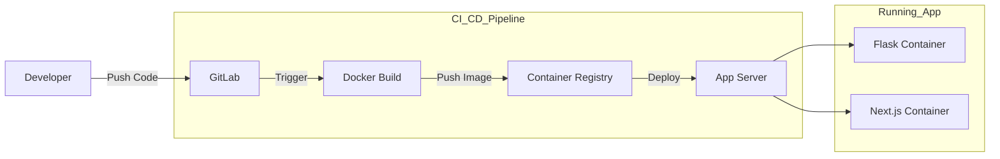
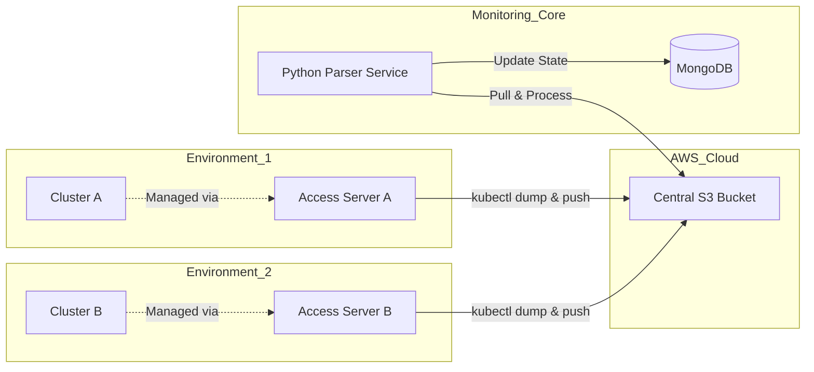
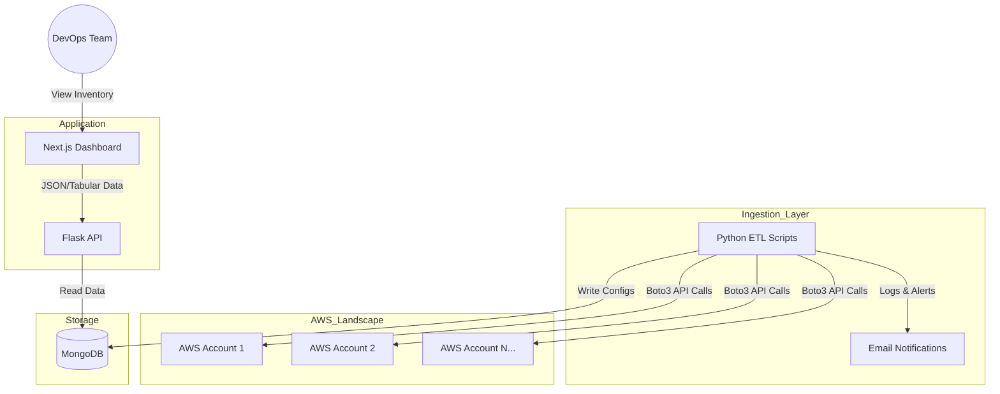

### Applicaton Flow

```mermaid
flowchart LR
    Dev[Developer] -->|Push Code| GitLab
    
    subgraph CI_CD_Pipeline
        GitLab -->|Trigger| Build[Docker Build]
        Build -->|Push Image| Registry[Container Registry]
        Registry -->|Deploy| Server[App Server]
    end
    
    subgraph Running_App
        Server --> Flask[Flask Container]
        Server --> Next[Next.js Container]
    end
```

### Kubernetes Flow

```mermaid
graph LR
    subgraph Environment_1
        C1[Cluster A]
        B1[Access Server A]
        C1 -.->|Managed via| B1
    end

    subgraph Environment_2
        C2[Cluster B]
        B2[Access Server B]
        C2 -.->|Managed via| B2
    end

    subgraph AWS_Cloud
        S3[Central S3 Bucket]
    end

    subgraph Monitoring_Core
        ETL[Python Parser Service]
        DB[(MongoDB)]
    end

    B1 -->|kubectl dump & push| S3
    B2 -->|kubectl dump & push| S3
    ETL -->|Pull & Process| S3
    ETL -->|Update State| DB
```

### AWS App Flow

```mermaid
graph TD
    subgraph AWS_Landscape
        A1[AWS Account 1]
        A2[AWS Account 2]
        An[AWS Account N...]
    end

    subgraph Ingestion_Layer
        B[Python ETL Scripts]
        B -->|Boto3 API Calls| A1
        B -->|Boto3 API Calls| A2
        B -->|Boto3 API Calls| An
        B -->|Logs & Alerts| Email[Email Notifications]
    end

    subgraph Storage
        DB[(MongoDB)]
    end

    subgraph Application
        API[Flask API]
        UI[Next.js Dashboard]
    end

    B -->|Write Configs| DB
    API -->|Read Data| DB
    UI -->|JSON/Tabular Data| API
    User((DevOps Team)) -->|View Inventory| UI
```
