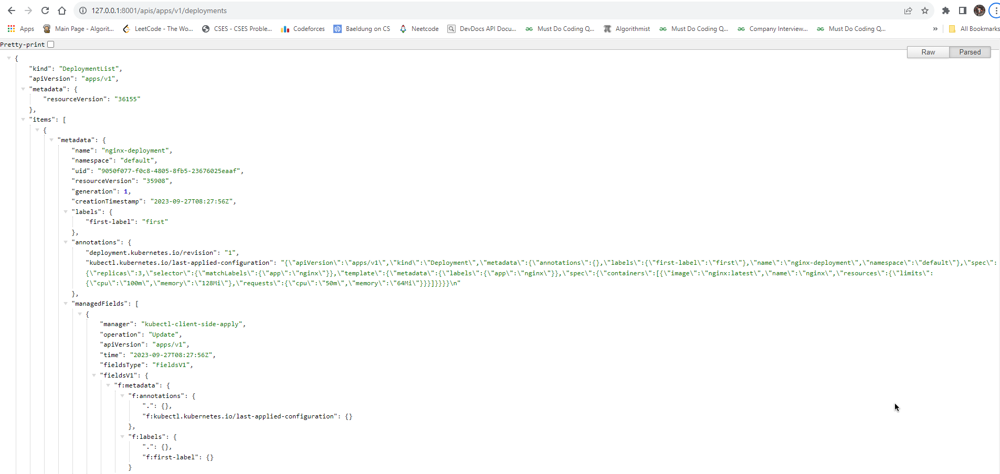
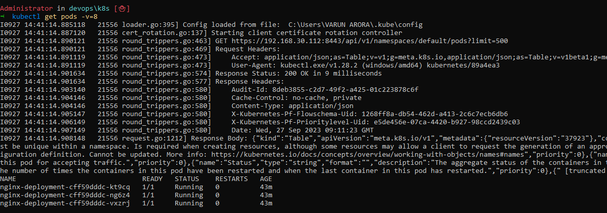
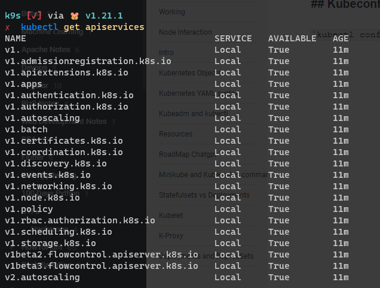
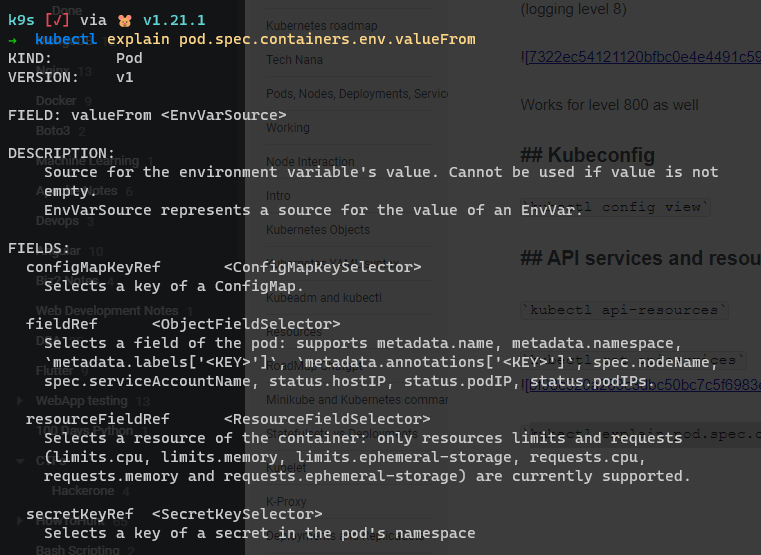
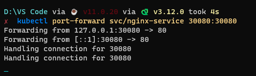
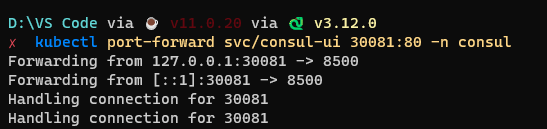
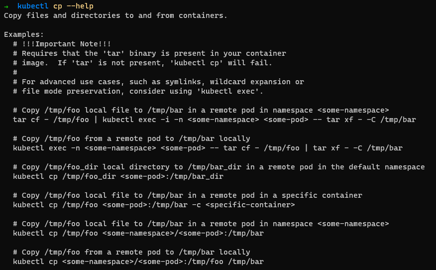

# Cheatsheet

https://kubernetes.io/docs/reference/kubectl/cheatsheet/

Type `kubectl` in command prompt to get this -

```
kubectl controls the Kubernetes cluster manager.

 Find more information at: https://kubernetes.io/docs/reference/kubectl/

Basic Commands (Beginner):
  create          Create a resource from a file or from stdin
  expose          Take a replication controller, service, deployment or pod and expose it as a new Kubernetes service
  run             Run a particular image on the cluster
  set             Set specific features on objects

Basic Commands (Intermediate):
  explain         Get documentation for a resource
  get             Display one or many resources
  edit            Edit a resource on the server
  delete          Delete resources by file names, stdin, resources and names, or by resources and label selector

Deploy Commands:
  rollout         Manage the rollout of a resource
  scale           Set a new size for a deployment, replica set, or replication controller
  autoscale       Auto-scale a deployment, replica set, stateful set, or replication controller

Cluster Management Commands:
  certificate     Modify certificate resources.
  cluster-info    Display cluster information
  top             Display resource (CPU/memory) usage
  cordon          Mark node as unschedulable
  uncordon        Mark node as schedulable
  drain           Drain node in preparation for maintenance
  taint           Update the taints on one or more nodes

Troubleshooting and Debugging Commands:
  describe        Show details of a specific resource or group of resources
  logs            Print the logs for a container in a pod
  attach          Attach to a running container
  exec            Execute a command in a container
  port-forward    Forward one or more local ports to a pod
  proxy           Run a proxy to the Kubernetes API server
  cp              Copy files and directories to and from containers
  auth            Inspect authorization
  debug           Create debugging sessions for troubleshooting workloads and nodes
  events          List events

Advanced Commands:
  diff            Diff the live version against a would-be applied version
  apply           Apply a configuration to a resource by file name or stdin
  patch           Update fields of a resource
  replace         Replace a resource by file name or stdin
  wait            Experimental: Wait for a specific condition on one or many resources
  kustomize       Build a kustomization target from a directory or URL

Settings Commands:
  label           Update the labels on a resource
  annotate        Update the annotations on a resource
  completion      Output shell completion code for the specified shell (bash, zsh, fish, or powershell)

Other Commands:
  api-resources   Print the supported API resources on the server
  api-versions    Print the supported API versions on the server, in the form of "group/version"
  config          Modify kubeconfig files
  plugin          Provides utilities for interacting with plugins
  version         Print the client and server version information

Usage:
  kubectl [flags] [options]

Use "kubectl <command> --help" for more information about a given command.
Use "kubectl options" for a list of global command-line options (applies to all commands).
```

## Describe items

- `kubectl get all` - describes all the entities(services, pods, deployments, replicasets etc)
- `kubectl get pods` - shows all the pods running for default namespace
- `kubectl get svc` - get all services
- `kubectl get all rs` - get all replica sets
- `kubectl get pods -n <my-namespace>` - shows running pods for `<my-namespace>` running.

---

## `kubectl describe <resource-type> <resource-name>`

- **pod** - `kubectl describe pod my-pod`
- **service** - `kubectl describe service my-service`
- **deployment** - `kubectl describe deployment my-deployment`
- **namespace** - `kubectl describe namespace my-namespace`
- **configMap** - `kubectl describe configmap my-config`
- **node** - `kubectl describe node my-node`
- **ingress** - `kubectl describe ingress my-ingress`
- **statefulset** - `kubectl describe statefulset my-statefulset`

## Delete resources

`kubectl delete pod <podname> -n <namespace>`

If applied via a file, do `kubectl delete -f filename.yaml` and this will stop all items created via that file.

`kubectl get pods -o=<output_format>` example _yaml_ or _json_.

Refer to k8s cheatsheet for more commands.

`kubectl api-resources -o=wide` to check k8s resources.

## Exec inside pod

`kubectl exec -it pod/pod_name -n namespace`

`kubectl logs pod_name -n namespace`

## More Metrics info

`kubectl top node` - all metrics abt nodes

`kubectl top pod -A` - resource info abt all namespaces

`kubectl top pod -n namespace` - particular namespace info

## Metrics API request

https://www.metricfire.com/blog/how-to-monitor-your-kubernetes-metrics-server/

Some clusters include default server metrics deployment. To check whether the metrics server is running on your cluster, run the following command:

`kubectl get pods --all-namespaces | grep metrics-server`
If the metrics server is running, then in the response, you will see information about the running nodes. Otherwise, run the following command to install the latest version of server metrics.

`kubectl apply -f https://github.com/kubernetes-sigs/metrics
server/releases/latest/download/components.yaml`

## Querying metric API Raw Request

After setting server metrics, you can get metrics for any node or pod using the kubectl get tool. Use the following commands to get metrics for all nodes and pods.

```
# Get the metrics for all nodes
kubectl get --raw /apis/metrics.k8s.io/v1beta1/nodes

# Get the metrics for all pods
kubectl get --raw /apis/metrics.k8s.io/v1beta1/pods
```

You can also get metrics separately for one selected node or pod. To do this, you need to specify its name, as shown in the following commands.

```
# Get the metrics for node <node_name>
kubectl get --raw /apis/metrics.k8s.io/v1beta1/<node_name> |  jq '.'
# Get the metrics for pode <pod_name>
kubectl get --raw /apis/metrics.k8s.io/v1beta1/<pod_name> | jq '.'
```

To get a list of all nodes or pods in a given namespace, run the kubectl get nodes, or kubectl get pods command, respectively.

The Metric API returns the result in JSON format. To display JSON in a human-readable form in the terminal, use the jq utility to output.

Use the kubectl top command to get the current CPU and memory usage for all or individual nodes or pods. The following command returns resource usage by all pods.

`kubectl top pod`

## Kubernetes dashboard for watching metrics

Kubernetes dashboard is a graphical tool for monitoring and managing a cluster. It provides the same functionality as kubectl. The Kubernetes dashboard has a panel that provides a convenient breakdown of metrics for each node and pod. In addition, the dashboard has charts that allow you to track how the metrics have changed over a certain period of time.

To install the latest version of the Kubernetes dashboard, run the following command:

`kubectl apply -f https://raw.githubusercontent.com/kubernetes/dashboard/v1.10.1/src/deploy/recommended/kubernetes-dashboard.yaml`

To access the dashboard interface through the browser, run the following command:

## Expose kubernetes to localhost without certificate auth

**`kubectl proxy`**

Next, you need to generate and enter an authentication token using the command:

`kubectl --namespace kubernetes-dashboard describe secret $(kubectl -n kubernetes-dashboard get secret | grep admin-user | awk '{print $1}')`

After completing the authentication, the dashboard graphical interface will be available to you, and you can use it to monitor metrics and edit Kubernetes objects.

## kubectl proxy API server

Inside minikube run command `kubect proxy` and there it starts localhost API server -
http://127.0.0.1:8001/apis/apps/v1/deployments



## Raw requests

```
# Sends HTTP GET request
$ kubectl get --raw /api/v1/namespaces/default/pods

# Sends HTTP POST request
$ kubectl create --raw /api/v1/namespaces/default/pods -f file.yaml

# Sends HTTP PUT request
$ kubectl replace --raw /api/v1/namespaces/default/pods/mypod -f file.json

# Sends HTTP DELETE request
$ kubectl delete --raw /api/v1/namespaces/default/pods
```

## API concepts

https://kubernetes.io/docs/reference/using-api/api-concepts/
See more details about about API

## API health endpoints

https://kubernetes.io/docs/reference/using-api/health-checks/

`curl -k https://localhost:6443/livez?verbose`

or from a remote host with authentication:

`kubectl get --raw='/readyz?verbose'`

The Kubernetes API server also supports to exclude specific checks. The query parameters can also be combined like in this example:

`curl -k 'https://localhost:6443/readyz?verbose&exclude=etcd'`

## Blog about API auth with ssl certificate

**Important** - https://iximiuz.com/en/posts/kubernetes-api-call-simple-http-client/

## Logging levels

We can get info about pods with various logging levels -

`kubectl get pods -v=8`
(logging level 8)



Works for level 800 as well

## Kubeconfig

`kubectl config view`

## API services and resources

`kubectl api-resources`

`kubectl get apiservices`


`kubectl explain pod.spec.containers.env.valueFrom`


## kubectl events

```
# list events by timestamp
kubectl get events --sort-by=.metadata.creationTimestamp

# list all warning packets
kubectl events --types=warning

# in json format
kubectl get events -o json

kubectl get events -n default
```

```
         {
  4             "apiVersion": "v1",
  5             "count": 1,
  6             "eventTime": null,
  7             "firstTimestamp": "2023-09-29T06:51:24Z",
  8             "involvedObject": {
  9                 "kind": "Node",
 10                 "name": "minikube",
 11                 "uid": "minikube"
 12             },
 13             "kind": "Event",
 14             "lastTimestamp": "2023-09-29T06:51:24Z",
 15             "message": "Starting kubelet.",
 16             "metadata": {
 17                 "creationTimestamp": "2023-09-29T06:51:31Z",
 18                 "name": "minikube.17894bfd0095f420",
 19                 "namespace": "default",
 20                 "resourceVersion": "109",
 21                 "uid": "32ad9042-a6af-4140-a05a-45e2dd88742e"
 22             },
 23             "reason": "Starting",
 24             "reportingComponent": "",
 25             "reportingInstance": "",
 26             "source": {
 27                 "component": "kubelet",
 28                 "host": "minikube"
 29             },
 30             "type": "Normal"
 31         },
```

## kubectl cluster change of state

```
# compares the current state of cluster against current state(applied configuration) and manifest config

kubectl diff -f ./my-manifest.yml
```

This is important when `kubectl edit deployment/my-deployment` has been done

## kubectl rollout

https://learnk8s.io/kubernetes-rollbacks

```
kubectl set image deployment/frontend www=image:v2               # Rolling update "www" containers of "frontend" deployment, updating the image
kubectl rollout history deployment/frontend                      # Check the history of deployments including the revision
kubectl rollout undo deployment/frontend                         # Rollback to the previous deployment
kubectl rollout undo deployment/frontend --to-revision=2         # Rollback to a specific revision
kubectl rollout status -w deployment/frontend                    # Watch rolling update status of "frontend" deployment until completion
kubectl rollout restart deployment/frontend                      # Rolling restart of the "frontend" deployment
```

It is useful in case you want to go back to **previous rollout** without running pipeline again. **Kubernetes stores past 10 rollouts, you can set them as well**.

```
spec:
	revisionHistoryLimit: 100
```

Here you set storing the past 100 replicasets with pods=0

`kubectl rollout undo deployment/frontend --to-revision=2 ` rolls back to 2nd revision.

```
deployments "nginx-deployment"
REVISION    CHANGE-CAUSE
1           kubectl apply --filename=https://blinkops.com/examples/controllers/nginx-deployment.yaml
2           kubectl set image deployment/nginx-deployment nginx=nginx:1.12.1
3           kubectl set image deployment/nginx-deployment nginx=nginx:1.121
```

To check **status of rollback** - `kubectl rollout status deployment/<deployment_name>` and then verifu by command `kubectl rollout history deployment/<deployment_name>`

_How do you know which one was the last ReplicaSet used? Or the third?_
Kubernetes stores the revision in the `ReplicaSet.metatada.annotation`.

You can view yaml file of replicaset with revision to see.

## Patching

`kubectl patch node k8s-node-1 -p '{"spec": "unschedulable"}'`

## Editing

`kubectl edit svc/nginx-service`

## Logs

```
# out logs
kubectl logs my-pod

# labelled pod logs
kubectl logs -l name=myLabel

# logs of container inside pod
kubectl logs my-pod -c my-container

# stream logs
kubectl logs -f my-pod

```

## More Important commands

```
# Attach to Running Container
kubectl attach my-pod -i

kubectl port-forward my-pod 5000:600
kubectl exec my-pod -it  -- bash

# metrics of pod
kubectl top pod POD_NAME --containers
kubectl top pod POD_NAME --sort-by=cpu

kubectl port-forward svc/my-service 5000:my-service-port

# mark node as non-schedulable
kubectl cordon my-node

# drain for maintenance preparation
kubectl drain my-node

# mark node schedulable
kubectl uncordon my-node

kubectl top node my-node

# address of master and services
kubectl cluster-info

# dump of cluster info for debugging
kubectl cluster-info dump

kubectl taint nodes foo dedicated=special-user:NoSchedule

# show pod endpoints connected to service when svc gets attached
kubectl get endpoints

# check changes made via `kubectl set` command
kubectl rollout status deployments/kubernetes-bootcamp

# undo a rollout
kubectl rollout undo deployments/kubernetes-bootcamp
```

## Cluster cidr

`kubectl cluster-info dump | grep -m 1 cluster-cidr`

## API resources

```
kubectl api-resources
kubectl api-resources --namespaced=true
kuectl api-resources -o wide
```

## Kubectl output for verbosity

```
--v=0	Generally useful for this to always be visible to a cluster operator.
--v=1	A reasonable default log level if you don't want verbosity.
--v=2	Useful steady state information about the service and important log messages that may correlate to significant changes in the system. This is the recommended default log level for most systems.
--v=3	Extended information about changes.
--v=4	Debug level verbosity.
--v=5	Trace level verbosity.
--v=6	Display requested resources.
--v=7	Display HTTP request headers.
--v=8	Display HTTP request contents.
--v=9	Display HTTP request contents without truncation of contents
```

Example - `kubectl get pod -v=9`

## Run multiple commands inside pod at startup

https://stackoverflow.com/questions/33887194/how-to-set-multiple-commands-in-one-yaml-file-with-kubernetes

```
command: ["/bin/sh","-c"]
args: ["command one; command two && command three"]
```

Another similar way -

```yml
containers:
  - name: mysqldump
    image: mysql
    command: ["/bin/sh", "-c"]
    args:
      - echo starting;
        ls -la /backups;
        mysqldump --host=... -r /backups/file.sql db_name;
        ls -la /backups;
        echo done;
    volumeMounts:
      - ...
```

## Kubectl patch

patch-file.yml:

```yml
spec:
  template:
    spec:
      containers:
        - name: patch-demo-ctr-2
          image: redis
```

(The patch file takes ordering based on deployment structure applies changes based on that)

## Rolling updates

`kubectl patch deployment my-deployment --patch-file patch-file.yml`

---

## Debugging pod using ephermal containers

`kubectl debug` command is used for same.

Run `kubectl debug --help` for example
You can instead add a debugging container using `kubectl debug`. If you specify the -i/--interactive argument, kubectl will automatically attach to the console of the Ephemeral Container.
`kubectl debug -it ephemeral-demo --image=busybox:1.28 --target=ephemeral-demo`

Another way -
`kubectl debug myapp -it --image=ubuntu --share-processes --copy-to=myapp-debug`

**Note -**

- kubectl debug automatically generates a container name if you don't choose one using the --container flag.
- The -i flag causes kubectl debug to attach to the new container by default. You can prevent this by specifying --attach=false. If your session becomes disconnected you can reattach using kubectl attach.
- The --share-processes allows the containers in this Pod to see processes from the other containers in the Pod

## Port forwarding to deployment

Reference - https://kubernetes.io/docs/tasks/access-application-cluster/port-forward-access-application-cluster/#forward-a-local-port-to-a-port-on-the-pod

If you are working **locally** and want to forward traffic to a specific port, you can run command `kubectl port-forward deployment/nginx-deployment 33333:80` where **33333 is host port and 80 is deployment port**.

The above as port forwarding to deployment, you can **port-forward service as well**.
`kubectl port-forward svc/nginx-service 30080:30080`

Here it port forwards from NodePort to pod 80 port.



Here see that **on left hand we have the host port and on right we have Resource port**



Using command `minikube tunnel`, we expose **NodePort to localhost and not other ingress**

## fqdn

For a service it is represented by `<service_name>.<namespace>.svc.cluster.local:<service_port>`.

Create nginx-service and nginx-deployment and go inside pod via `kubectl exec -it container-name -n namespace -- bash`.

Then do `curl localhost:80` and then `curl nginx-service.default.svc.cluster.local:30080`(30080 is the nodeport which has target 80)

`kubectl describe pod/current-pod` and then get the **endpoint** and go inside pod, run `curl ip:port` again to see same result. You can also do `hostname -i` inside pod or `kubectl get endpoints` to get endpoints to do.

## Open `kubectl edit` inside vscode

Follow the gist - https://gist.github.com/mordr/3c2df494c690672247c720f66f0fb613
and for **cmd**, to to **system environment variables** and enter new variable `KUBE_EDITOR="code -w"` (store value without quotes)

## Raw requests

Certainly! Here's a long list of useful `curl` examples for making raw API GET requests in Kubernetes:

1. **List All Nodes**:

```bash
   curl -H "Authorization: Bearer $(cat /var/run/secrets/kubernetes.io/serviceaccount/token)" \
        -H "Accept: application/json" \
        https://localhost:443/api/v1/nodes
```

2. **Get a List of All Namespaces**:

```bash
   curl -H "Authorization: Bearer $(cat /var/run/secrets/kubernetes.io/serviceaccount/token)" \
        -H "Accept: application/json" \
        https://localhost:443/api/v1/namespaces
```

3. **Get Cluster-wide Events**:

```bash
   curl -H "Authorization: Bearer $(cat /var/run/secrets/kubernetes.io/serviceaccount/token)" \
        -H "Accept: application/json" \
        https://localhost:443/api/v1/events
```

4. **Get Cluster-wide Persistent Volumes (PVs)**:

```bash
   curl -H "Authorization: Bearer $(cat /var/run/secrets/kubernetes.io/serviceaccount/token)" \
        -H "Accept: application/json" \
        https://localhost:443/api/v1/persistentvolumes
```

5. **Get Cluster-wide Persistent Volume Claims (PVCs)**:

```bash
   curl -H "Authorization: Bearer $(cat /var/run/secrets/kubernetes.io/serviceaccount/token)" \
        -H "Accept: application/json" \
        https://localhost:443/api/v1/persistentvolumeclaims
```

6. **List All ConfigMaps in a Namespace**:

```bash
   curl -H "Authorization: Bearer $(cat /var/run/secrets/kubernetes.io/serviceaccount/token)" \
        -H "Accept: application/json" \
        https://localhost:443/api/v1/namespaces/<namespace>/configmaps
```

Replace `<namespace>` with the desired namespace.

7. **List All Secrets in a Namespace**:

```bash
   curl -H "Authorization: Bearer $(cat /var/run/secrets/kubernetes.io/serviceaccount/token)" \
        -H "Accept: application/json" \
        https://localhost:443/api/v1/namespaces/<namespace>/secrets
```

Replace `<namespace>` with the desired namespace.

8. **Get Cluster-wide ClusterRoles**:

```bash
   curl -H "Authorization: Bearer $(cat /var/run/secrets/kubernetes.io/serviceaccount/token)" \
        -H "Accept: application/json" \
        https://localhost:443/apis/rbac.authorization.k8s.io/v1/clusterroles
```

9. **List All Cluster-wide ClusterRoleBindings**:

```bash
   curl -H "Authorization: Bearer $(cat /var/run/secrets/kubernetes.io/serviceaccount/token)" \
        -H "Accept: application/json" \
        https://localhost:443/apis/rbac.authorization.k8s.io/v1/clusterrolebindings
```

10. **Get the Status of a Pod in a Namespace**:

```bash
    curl -H "Authorization: Bearer $(cat /var/run/secrets/kubernetes.io/serviceaccount/token)" \
         -H "Accept: application/json" \
         https://localhost:443/api/v1/namespaces/<namespace>/pods/<pod-name>/status
```

Replace `<namespace>` with the desired namespace and `<pod-name>` with the name of the pod.

These examples cover a wide range of Kubernetes resources and API endpoints. Customize them to suit your specific use cases by replacing placeholders as needed.

## Create inventory for cluster information

- `kubectl get deployment,pod,svc,ing,secret,pvc -A | grep -v kube-system | grep -v helm | grep -v cloudwatch-agent | grep -v fluent-bit | grep -v guardduty | tee cluster-info.txt`
- `curl ident.me >> cluster-info.txt`

## Dry run command to see how it will go to cluster

By running this, it will show example yaml going to cluster and not sending the request.

`kubectl run my-pod --image=busybox:1.28 --command sleep 3200 --dry-run=client -oyaml`

## Copying files from pod to local

`kubectl cp <pod_name>:/path/to/file /path/of/local/machine`

example: `kubectl cp demo/mynginx-pod:/home/varun/index.html ~/Documents/index.html -c container_name(optional)`

Run command - `kubectl cp --help` for more info


If you want to create backups over a period, you can create cron jobs for same -

```yml
apiVersion: batch/v1beta1
kind: CronJob
metadata:
  name: backup-cronjob
spec:
  schedule: "0 0 * * *" # Run the job daily at midnight
  jobTemplate:
    spec:
      template:
        spec:
          containers:
            - name: backup-container
              image: your-backup-image:latest
              command: ["/bin/sh", "-c", "cp -r /path/to/container/folder /backup"]
              volumeMounts:
                - name: backup-storage
                  mountPath: /backup
          volumes:
            - name: backup-storage
              emptyDir: {}
        restartPolicy: Never
```

**Make sure volume is mounted to container with volume created before hand**

## `kubectl replace`

In some cases, you may need to update resource fields that cannot be updated once initialized, or you may want to make a recursive change immediately, such as to fix broken pods created by a Deployment. To change such fields, use replace --force, which deletes and re-creates the resource. In this case, you can modify your original configuration file:

`kubectl replace -f https://k8s.io/examples/application/nginx/nginx-deployment.yaml --force`
**It is imperative command and `kubectl apply` is probably better for most cases.**
