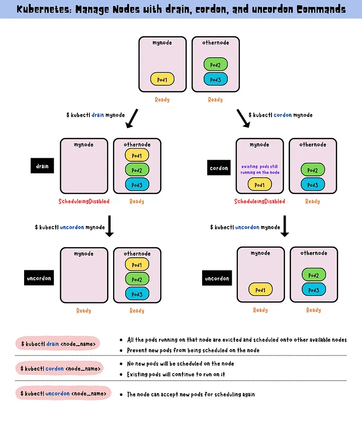

https://kubernetes.io/docs/tasks/administer-cluster/manage-resources/memory-default-namespace/

**LimitRange** If you mention the limits but not the requests then pod is assigned limit value as the request(for both memory and cpu) Make sure to have limits set for atleast memory and requests as well. You can set a default memory and cpu limit for a namespace as well. These are **namespace scoped**.

A LimitRange provides constraints that can:

- Enforce minimum and maximum compute resources usage per Pod or Container in a namespace.
- Enforce minimum and maximum storage request per PersistentVolumeClaim in a namespace.
- Enforce a ratio between request and limit for a resource in a namespace.
- Set default request/limit for compute resources in a namespace and automatically inject them to Containers at runtime.

Reference - https://kubernetes.io/docs/tasks/administer-cluster/limit-storage-consumption/

You can check namespace scoped resources via `kubectl api-resources --namespaced=true`

```yml
apiVersion: v1
kind: LimitRange
metadata:
  name: mem-limit-range
spec:
  limits:
    - default:
        memory: 512Mi
      defaultRequest:
        memory: 256Mi
      type: Container
```

If you set limit as 1gb and no requests, then both requests and limits will be set to 1gb.
If you create a pod with request 1.5Gi and limit memory 800Mi, it will give error.

This limit range is **applied to Pod or Container to set default limits by admin for them**. The above example have **default values which get applied if pod file does not have these**

## Setting namespace limits

Above code snippet generates **LimitRange resource** which is part of **v1** and sets limit based on the type of values passed.

```yml
apiVersion: v1
kind: LimitRange
metadata:
  name: cpu-min-max-demo-lr
spec:
  limits:
    - max:
        cpu: "800m"
      min:
        cpu: "200m"
      type: Container
```

The above defines the **max and min limits for pod and container in the namespace**.
**Error will be shown if violated**.

## Extended resources

https://kubernetes.io/docs/tasks/administer-cluster/extended-resource-node/

It is possible to extend resources to a node **like volume attached to it and you can divide it into further parts and advertise them as special storage of 100gb (8)**

Put the correct node name to replace

```
curl --header "Content-Type: application/json-patch+json" \
  --request PATCH \
  --data '[{"op": "add", "path": "/status/capacity/example.com~1dongle", "value": "4"}]' \
  http://localhost:8001/api/v1/nodes/<your-node-name>/status
```

You can later remove them by curl request as well in above url.

## CPU Management policies

Reference - https://kubernetes.io/docs/tasks/administer-cluster/cpu-management-policies/

If multiple pods running in node, it is possible cpu is throttled and pods workload may shift to other **cpu cores** based on availability. Many workloads are not sensitive to this migration and thus work fine without any intervention.

However, in workloads where **CPU cache affinity and scheduling latency significantly affect workload performance, the kubelet allows alternative CPU management policies to determine some placement preferences on the node**.
There are 2 supported policies -

- `static` - allows pods with certain resource characteristics to be granted increased CPU affinity and exclusivity on the node
- `none`(default)

### Change Management policies

- Drain the node `kubectl drain --ignore-daemonsets <node name>`
- Stop kubelet
- Remove the old CPU manager state file. The path to this file is `/var/lib/kubelet/cpu_manager_state` by default. This clears the state maintained by the CPUManager so that the cpu-sets set up by the new policy won’t conflict with it.
- Edit the kubelet configuration to change the CPU manager policy to the desired value
- Start kubelet

---

The `kubectl drain` subcommand on its own does not actually drain a node of its DaemonSet pods: the **DaemonSet controller** (part of the control plane) immediately **replaces missing Pods with new equivalent Pods**. The DaemonSet controller also **creates Pods that ignore unschedulable taints, which allows the new Pods to launch onto a node that you are draining**.

Once it returns (without giving an error), you can power down the node (or equivalently, if on a cloud platform, delete the virtual machine backing the node). If you leave the node in the cluster during the maintenance operation, you need to run `kubectl uncordon <node name>`



## Cordon, drain and uncordon

https://yuminlee2.medium.com/kubernetes-manage-nodes-with-drain-cordon-and-uncordon-commands-4f43e4203875

The **drain** command is used to gracefully remove a node from service by evicting all pods running on that node, scheduling them onto other available nodes and preventing new pods from being scheduled.
(**When a node is drained, all the pods running on that node are evicted and scheduled onto other available nodes. At the same time, it also prevents new pods from being scheduled on that node.**)

The **cordon** command is used to temporarily disable scheduling new pods on a node, while allowing existing pods to continue running until they complete.

The **uncordon** enables the scheduling of new pods onto a previously drained or cordoned node.

## Qos Classes

Pods have 3 QoS(Quality of service) Classes -

- **Guaranteed**
- **Burstable**
- **Best Effort**

**Guranteed**

- Every Container in the Pod must have a **memory limit** and a **memory request**.
- For every Container in the Pod, the **memory limit** must **equal** the **memory request**.
- Every Container in the Pod must have a **CPU limit** and a **CPU request**.
- For every Container in the Pod, the **CPU limit** must **equal** the **CPU request**.

These restrictions apply to init containers and app containers equally. Ephemeral containers cannot define resources so these restrictions do not apply.
Example -

```yml
apiVersion: v1
kind: Pod
metadata:
  name: qos-demo
  namespace: qos-example
spec:
  containers:
    - name: qos-demo-ctr
      image: nginx
      resources:
        limits:
          memory: "200Mi"
          cpu: "700m"
        requests:
          memory: "200Mi"
          cpu: "700m"
```

**Burstable**

- The Pod does not meet the criteria for QoS class Guaranteed
- **At least one Container in the Pod has a memory or CPU request or limit**

```yml
apiVersion: v1
kind: Pod
metadata:
  name: qos-demo-2
  namespace: qos-example
spec:
  containers:
    - name: qos-demo-2-ctr
      image: nginx
      resources:
        limits:
          memory: "200Mi"
        requests:
          memory: "100Mi"
```

_No cpu limit_

```yml
apiVersion: v1
kind: Pod
metadata:
  name: qos-demo-4
  namespace: qos-example
spec:
  containers:
    - name: qos-demo-4-ctr-1
      image: nginx
      resources:
        requests:
          memory: "200Mi"

    - name: qos-demo-4-ctr-2
      image: redis
```

_First does not have memory requests_

**Best Effort**
When a pod does not have any limits/requests defined, they fall under catagory of **best effort**

## Priority Classes, Preemption and Eviction

https://kubernetes.io/docs/concepts/scheduling-eviction/

## Change nodeselector of pod via patch file

https://stackoverflow.com/questions/55357287/update-node-selector-field-for-pods-on-the-fly

```yml
spec:
  template:
    spec:
      nodeSelector:
        kubernetes.io/hostname: node-2
```

`kubectl patch deployment nginx-deployment --patch "$(cat patch.yaml)"`

## ResourceQuota

https://kubernetes.io/docs/concepts/policy/resource-quotas/

It is used to set **quota for namespace** - **storage, memory and cpu**

- Different teams work in different namespaces. This can be enforced with RBAC.
- Users create resources (pods, services, etc.) in the namespace, and the quota system tracks usage to ensure it does not exceed hard resource limits defined in a ResourceQuota.
- If creating or updating a resource violates a quota constraint, the request will fail with HTTP status code 403 FORBIDDEN with a message explaining the constraint that would have been violated.
- If quota is enabled in a namespace for compute resources like cpu and memory, users must specify requests or limits for those values; otherwise, the quota system may reject pod creation. Hint: Use the LimitRanger admission controller to force defaults for pods that make no compute resource requirements.

## Auditing

https://kubernetes.io/docs/tasks/debug/debug-cluster/audit/

Kubernetes auditing provides a security-relevant, chronological set of records documenting the sequence of actions in a cluster. The cluster audits the activities generated by users, by applications that use the Kubernetes API, and by the control plane itself.

### Audit policy

Audit policy defines rules about what events should be recorded and what data they should include. The audit policy object structure is defined in the `audit.k8s.io` API group. When an event is processed, it's compared against the list of rules in order. The first matching rule sets the audit level of the event. The defined audit levels are:

- `None` - don't log events that match this rule.
- `Metadata` - log request metadata (requesting user, timestamp, resource, verb, etc.) but not request or response body.
- `Request` - log event metadata and request body but not response body. This does not apply for non-resource requests.
- `RequestResponse` - log event metadata, request and response bodies. This does not apply for non-resource requests.

## Find resource utilization WITHOUT metrics server via cgroups

https://octopus.com/blog/kubernetes-pod-cpu-memory

If the metrics service isn't available, it's still possible to determine the memory usage of a single pod by entering an interactive session and printing the contents of cgroup interface files.
Current usage -

- cat /sys/fs/cgroup/memory/memory.usage_in_bytes
- cat /sys/fs/cgroup/cpu/cpuacct.usage

If not cgroup but cgroup2

- cat /sys/fs/cgroup/memory.current
- cat /sys/fs/cgroup/cpu.stat

**Kubernetes exit codes** - https://komodor.com/learn/exit-codes-in-containers-and-kubernetes-the-complete-guide/

## horizontal pod autoscaler

https://kubernetes.io/docs/tasks/run-application/horizontal-pod-autoscale-walkthrough/

Refer above for load test and more info regarding hpa

Horizontal scaling means that the response to increased load is to deploy more Pods. This is different from vertical scaling, which for Kubernetes would mean assigning more resources (for example: memory or CPU) to the Pods that are already running for the workload.

Example via command `kubectl autoscale deployment php-apache --cpu-percent=50 --min=1 --max=10`

Example of declarative autoscaler -

```yml
apiVersion: autoscaling/v1
kind: HorizontalPodAutoscaler
metadata:
  name: php-apache
spec:
  scaleTargetRef:
    apiVersion: apps/v1
    kind: Deployment
    name: php-apache
  minReplicas: 1
  maxReplicas: 10
  targetCPUUtilizationPercentage: 50
```

**Use v2 hpa for scaling policies**

## Crictl and cluster debugging

crictl is a command-line interface for CRI-compatible container runtimes. You can use it to inspect and debug container runtimes and applications on a Kubernetes node

https://kubernetes.io/docs/tasks/debug/debug-cluster/crictl/

**Flow control** - https://kubernetes.io/docs/reference/debug-cluster/flow-control/

`Debug Endpoints` - With the `APIPriorityAndFairness` feature enabled, the kube-apiserver serves the following additional paths at its HTTP(S) ports.
Make sure you have proper permissions to access this

API - `/debug/api_priority_and_fairness/` and then specify `nonResourceURLs`

`kubectl get --raw /debug/api_priority_and_fairness/dump_priority_levels`

### Pod Debugging

https://kubernetes.io/docs/tasks/debug/debug-application/debug-running-pod/#ephemeral-container

## Multiple schedulers

- Kubernetes comes with default scheduler which may not be enough
- Multiple schedulers can run along the main scheduler.
- We can **instruct which scheduler to use in pods for definition files**
  - Add a new field called **schedulerName** in **pod yaml**
  - If scheduler not configured properly, pod will go in pending
- If multiple copies of same scheduler are running on different nodes(**multi-master**), one can be active via **leader election**

## Network Policy

- Pods can communicate with any other pod as flat networking
- To control traffic flow at IP address at layer 3 and 4, we consider **network policies**
- When defining pod/namespace based network policy, **use selector to specify traffic allowed to and from pod to match selector**

```yml
apiVersion: networking.k8s.io/v1
kind: NetworkPolicy
metadata:
  name: allow-nginx
  namespace: default
spec:
  podSelector:
    matchLabels:
      app: nginx
  policyTypes:
    - "ingress"
    - "egress"
  ingress:
    - from:
        - podSelector:
            matchLabels:
              role: backend
        - podSelector:
            matchLabels:
              role: database
```

## ETCD

- Distributed key-value store
- stores data regarding cluster like nodes, services, pods, configmaps, account, roles etc
- listens at port **2379** by default.
- Use **etcdctl** for etcd commands on etcd control pane such as backup.
- https://medium.com/@mehmetodabashi/backup-and-restore-etcd-cluster-on-kubernetes-93c19b1c070
- **Take backup** - `ETCDCTL_API=3 etcdctl --endpoints $ENDPOINT snapshot save snapshot.db`, where endpoint is `127.0.0.1:2379`
- **Restore backup from .db** -

```
ETCDCTL_API=3 etcdctl --endpoints=https://127.0.0.1:2379 \
--cacert=/etc/kubernetes/pki/etcd/ca.crt \
--cert=/etc/kubernetes/pki/etcd/server.crt \
--key=/etc/kubernetes/pki/etcd/server.key \
snapshot save <backup-file-location>
```
