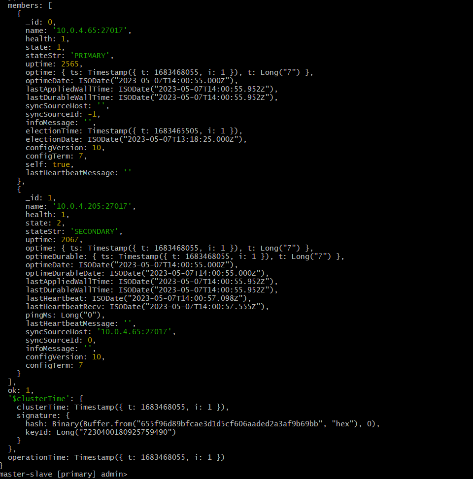

# Resource

https://www.mongodb.com/docs/v2.4/core/master-slave/

## IMPORTANT

If stuck, first check `netstat -tulnp` and `mongod -f config.conf` to see if it is running or not.

**Make sure both are on same VPC with security groups configured**.
Use **mongod -f config_file.conf** to start with **forked** processes to run them.

Here is **SECONDARY** node config file

## slave.conf

```yml
storage:
  dbPath: /usr/local/var/mongodb/slave
net:
  bindIp: 0.0.0.0
  port: 27017
security:
  authorization: enabled
  keyFile: /usr/local/var/mongodb/pki/replicaset-keyfile
systemLog:
  destination: file
  path: /usr/local/var/log/mongodb/slave/mongod.log
  logAppend: true
processManagement:
  fork: true
replication:
  replSetName: master-slave
```

**BindIp** means it is listening to IP addresses mentioned. Here **0.0.0.0** means all of them, **127.0.0.1** is same as **localhost only**.
It must listen at **0.0.0.0** to listen to all connections as slave.

**TODO** - Multiple IPs here in bindIP did not work properly

The directories **/usr/local/var/mongodb/slave**, **/usr/local/var/mongodb/pki** and **/usr/local/var/log/mongodb/slave** have to be created before hand.

**NOTE** - The names of **replSetName** must be same as well.

In order to get **authentication**, we use **OpenSSL** to generate **keyfile** using **base64** encoding which must be in both EC2 for **communication**.

## Create Keyfile in all machines

```sh
sudo mkdir -p /usr/local/var/mongodb/pki/
openssl rand -base64 741 > /usr/local/var/mongodb/pki/replicaset-keyfile
chmod 400 /usr/local/var/mongodb/pki/replicaset-keyfile
```

## Master.conf

```yml
# mongod.conf

# for documentation of all options, see:
#   http://docs.mongodb.org/manual/reference/configuration-options/

# where to write logging data.
systemLog:
  destination: file
  logAppend: true
  path: /var/log/mongodb/masternode/mongod.log

# Where and how to store data.
storage:
  dbPath: /var/lib/mongo/masterdb
  journal:
    enabled: true
#  engine:
#  wiredTiger:

# how the process runs
processManagement:
  fork: true
  timeZoneInfo: /usr/share/zoneinfo

# network interfaces
net:
  port: 27017
  bindIp: 10.0.4.65 # Enter 0.0.0.0,:: to bind to all IPv4 and IPv6 addresses or, alternatively, use the net.bindIpAll setting.

#security:
security:
  authorization: enabled
  keyFile: /usr/local/var/mongodb/pki/replicaset-keyfile

#replication:
replication:
  replSetName: master-slave
```

Here also we create the directories **/var/log/mongodb/masternode/** and **/var/lib/mongo/masterdb** with **keyfile path**.
Here we also set the **BindIp** to **10.0.4.65** which is the **machine's IP** on port 27017.

**Note -** Different machines can run mongo instances on **same 27017 port**.

---

## Start Master

Run `mongod -f mongod.conf` to run child process.

Check `netstat -tulnp` to find **mongod** as child process running.

Then run `mongosh --port 27017` to **create user and roles**.

There run command -

```
rs.initiate(); // to initiate the replica set
use admin;     //switch to admin database for creating root user
db.createUser({
 user: "test-user",
 pwd: "test-pass",
 roles: [{ role: "root", db: "admin"}]
});
```

It initiates **replica** and we change **database to admin** and then **create user** in it with **role assigned as root of admin database**. This is to give read/write permissions to only **user created**.

Now disconnect by ctrl+c and login to replica by credentials u entered as -
`mongosh --host "master-slave/10.0.4.65:27017" -u "test-user" -p "test-pass" --authenticationDatabase "admin"`

Run `rs.isMaster()` to check is current node is master.

There we add user `rs.add('10.0.4.205:27017')` as **SECONDARY** while previous was primary.

For checking the connection run `rs.status()`

**Note -** `rs.initiate()` cannot be done again but we can change hostnames and mroe things(https://www.mongodb.com/docs/manual/tutorial/change-hostnames-in-a-replica-set/)

```
cfg = rs.conf()
cfg.members[0].host = "mongodb0.example.net:27017"
rs.reconfig(cfg)
```

## Secondary SS


## Primary SS


### rs.status()




## Adding Read user for Secondary

First authenticate inside the master and then write the command inside `db.createUser({user: 'user1', pwd: 'pass', roles: [{ role: 'read', db: 'myDB' }] })` after making **myDB**.
Then make a collection inside and insert data to later check.

Do `db.myCollection.find()` to see the data inside.

### Authenticate in SECONDARY node

Inside secondary machine, type `mongosh` which starts at port 27017.
Do `use myDB` to switch to it for use.

On `show collections` you might get authentication error.


**Authenticate user for read permissions via command `db.auth({user: "user1", pwd: "pass"})`**

Now the user must be authenticated for **READ** permissions and test this by `myDB.myCollection.find()`


It gives error as read preference is by default **primaryPreferred**

Use command `rs.secondaryOK()` to give read permissions to **secondary** nodes as well.


**rs.config()**


**TODO** - implement `rs.stepDown()`

---

#### Additional MongoDB resources -

- https://www.mongodb.com/basics
- https://www.mongodb.com/docs/manual/
- https://www.mongodb.com/databases/scaling
- https://www.parkplacetechnologies.com/blog/storage-performance-metrics/

## Very important mongodb cluster

https://medium.com/swlh/mongodb-creating-a-3-node-replica-set-cluster-7ca94849b139
