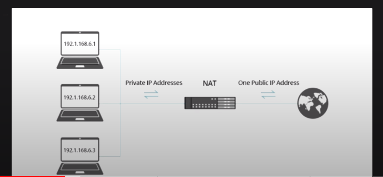
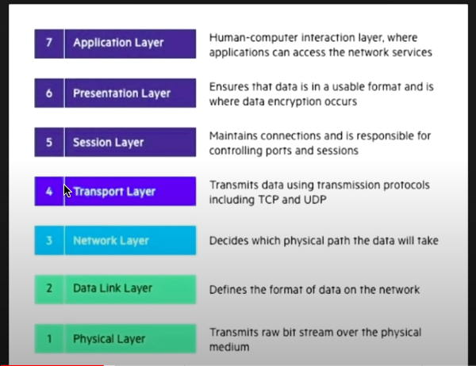
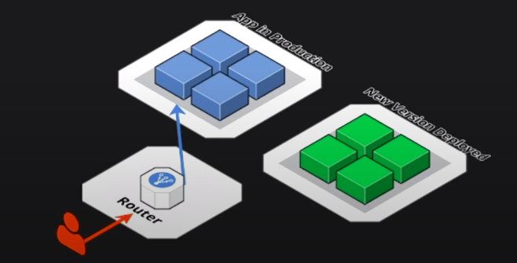
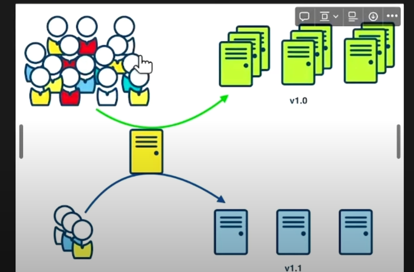

**IOPS (Input/Output Operations Per Second)** is a measure of the **NUMBER of input/output operations that a system can perform in a second**. An I/O operation refers to **any read or write operation that accesses data on a storage device**, such as a hard disk drive or solid-state drive. IOPS is typically used to **measure the random access performance of a storage system, since random I/O operations are typically more demanding than sequential I/O operations**.

**Throughput**, on the other hand, refers to the **AMOUNT of data that a system can transfer in a given period of time**, typically measured in megabytes per second (MB/s) or gigabytes per second (GB/s). Throughput is often used to measure the **sequential access performance of a storage system, since sequential I/O operations are typically more efficient than random I/O operations**.
Throughput is determined by the **speed and capacity of the storage medium**, as well as other factors such as the size of the I/O requests, the number of concurrent I/O operations, and the efficiency of the I/O subsystem.

**Latency** measures the **time between issuing a request and receiving a response**. With regards to IOPS, latency is a measure of the length of time it takes for a single I/O request to be completed from the application's point of view.

**A storage system with high IOPS but low throughput may be well-suited for random access workloads, such as database transactions, while a storage system with high throughput but low IOPS may be better suited for sequential access workloads, such as video streaming or batch processing.**

Both are related and must be considered together for for measuring system performance and evaluating workload.

In terms of workload consider IOPS to measure speed of transfer of items at different memory locations which are **not contiguous**(like transfer many pics in a folder, loading game textures, accessing large media files)
Throughput examples would be **stream of data** such as audio, video(contiguous memory)

In devops, IOPS workload would be dealing with CI/CD pipeline dealing with **code/commit changes, running tests on the machine**. Faster iops lead to faster execution of these tasks. Faster IOPS is also important for **logging** for **writing and reading log data**. It becomes important for analyzing log files for troubleshooting or **monitoring** purposes.

Throughput examples would be dealing with **artifacts, docker images, compiled binaries, data replication, backups**.

NAT - **Network Address Translation** it is used to map IP address to another by changing header of IP packets while transit via router. It comes handy providing internet access to resources in private networks via NAT and public route to update/install items **of private subnet resources(ec2, db)**
They protect items like databases to not expose their IPs to internet but are exposed via NAT

## OSI Layer

**Application load balancer** falls in layer **7** whereas **Network** Load balancer is in layer **4**

## Firewall

Network security device of software that monitors incoming and outgoing traffic based on predefined security rules. It acts as barrier btw trusted internal network and untrusted external network.

## Blue Green Deployment

Deployment strategy where 2 identical environments(Blue and Green) exist where you switch traffic between them when deploying new versions. This minimizes down time and allows quick rollbacks

## Canary Deployment

Strategy where a new version of application is deployed to small subset of users allowing for testing and validation. If performed well, it is rolled out to entire user base.

