Here is guide how you can easily deploy nginx web server on **minikube** locally with common kubernetes terms explaied as well in the tutorial.

## Nginx Deployment

```yml
apiVersion: apps/v1
kind: Deployment
metadata:
  name: my-nginx-deployment
spec:
  replicas: 3
  selector:
    matchLabels:
      app: nginx-deployment
  template:
    metadata:
      labels:
        app: nginx-deployment
    spec:
      containers:
        - name: nginx
          image: nginx:latest
          ports:
            - containerPort: 80
              protocol: TCP
          resources:
            limits:
              cpu: "500m" # 500 milliCPU (0.5 CPU)
              memory: "512Mi" # 512 Mebibytes
            requests:
              cpu: "200m" # 200 milliCPU (0.2 CPU)
              memory: "256Mi" # 256 Mebibytes
```

Note - we have to use **apps/v1** for **Deployment** and **metadata** is very important. The name **nginx-deployment** in metadata refers to name of deployment.

This name must match with **selector -> matchLabels -> app** name.
The **spec** means specification of the **deployment**. T

If **selector matchlabels** do not match **template labels**, it gives error.

**Properly add tabs at each line as bad spaces lead to misconfigurations and errors**.

## NodePort code to expose 80 port of nginx to outside

```yml
apiVersion: v1
kind: Service
metadata:
  name: nginx-deployment-nodeport
spec:
  type: NodePort
  selector:
    app: nginx-deployment
  ports:
    - protocol: TCP
      port: 8080
      targetPort: 80
```

Here **`targetPort`** is **port on pods targeted by service** and **`port`** is the port of service exposed.
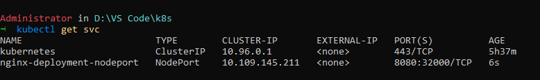

Note - Type `minikube ip` in terminal and then `curl http://<minikube_ip>:<port_number>` to see the response.

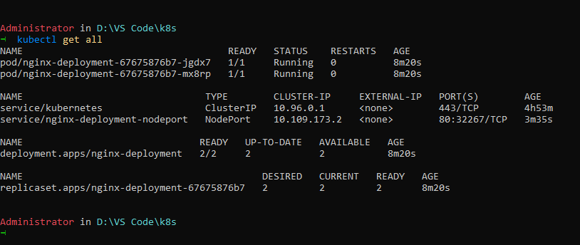

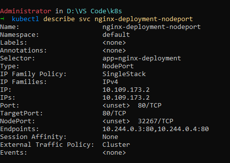

This port `80` of deployment is mapped to **32267** of minikube and can be accessed via minikube ip.
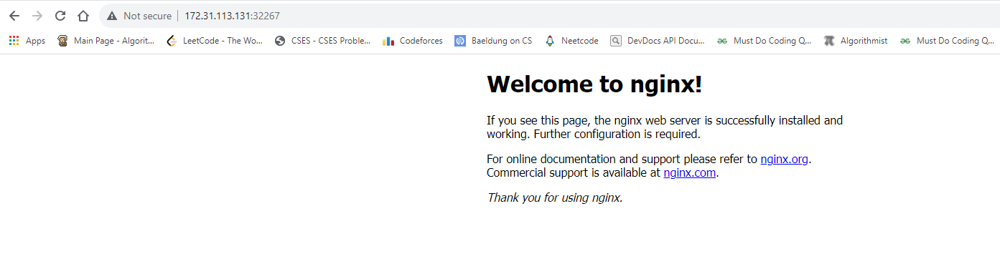

## Note -

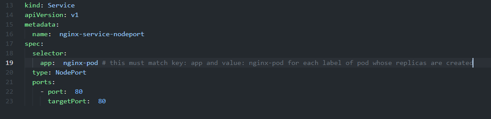

In order to check do `kubectl get svc` and check the **endpoints** of **service** to confirm if pods are connected to it or not.

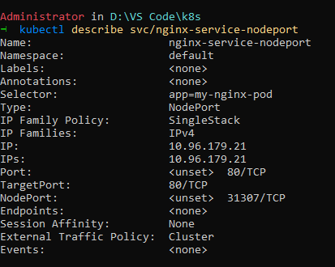

if **endpoints** is **none**, it means service is not connected to the pods.
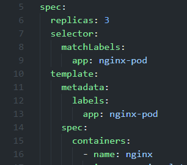

It is important that the **selector.matchLabels.keyName** matches the **metadata.labels.keyName** and here **keyName** is **app**. And this `app: nginx-pod` must match **selector.keyName** of the **service**.
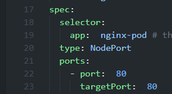

## Editing Deployments

You can edit existing deployments by `kubectl edit deployment/my-nginx-deployment` and this opens the current yaml file.

If things are changed then it creates another deployment to replace the existing and once done, it sets the running pods to 0 of old deployment and uses the edited yaml as the new deployment.

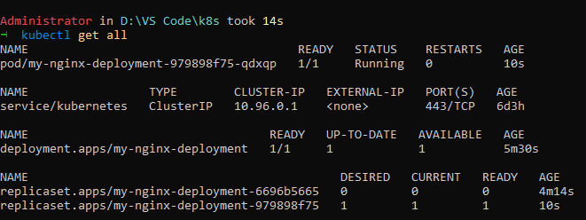

Here the pods are set to 0 of the replicaset created declaratively via deployment.
Use `kubectl describe` to see the changes being visible.

After editing, **rollout changes are being made**. `kubectl rollout status deployment/nginx-deployment` to see the status.

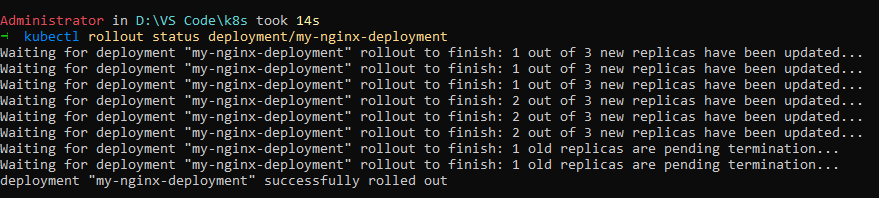

**kubectl describe deployments** gives the result -

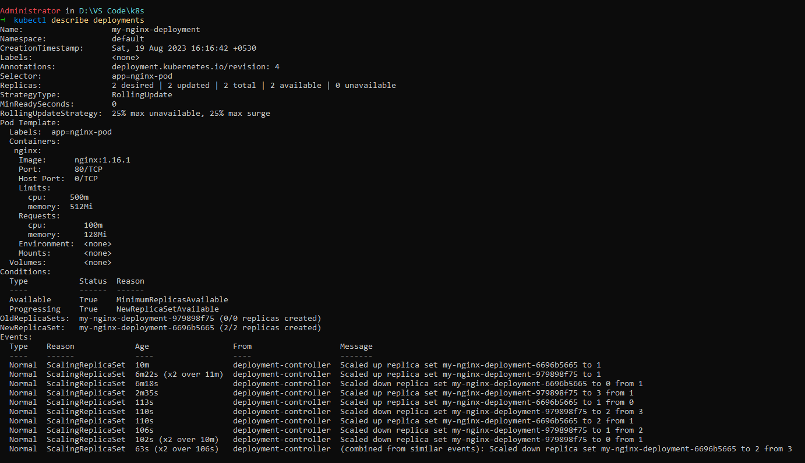
_please open above image in new tab_

**Note** -

- If you update a Deployment while an existing rollout is in progress, the Deployment creates a new ReplicaSet as per the update and start scaling that up, and rolls over the ReplicaSet that it was scaling up previously -- it will add it to its list of old ReplicaSets and start scaling it down.
- In API version apps/v1, a **Deployment**'s label selector is **immutable** after it gets created. It is better to decide your selectors before hand.

## Rollback Deployments

`kubectl rollout history deployment/nginx-deployment` use this command to check the rollback history.
Output -
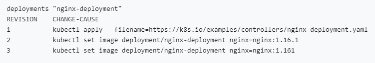

To get details of each revision, do `kubectl rollout history deployment/nginx-deployment --revision=2`

## To rollback to a previous version

`kubectl rollback undo deployment/nginx-deployment` - this will rollback to just previous deployment.

`kubectl rollout undo deployment/nginx-deployment --to-revision=2` - this will rollback to **revision number 2** as the specific version.

## Scaling deployments

`kubectl scale deployment/nginx-deployment --replicas=10`
