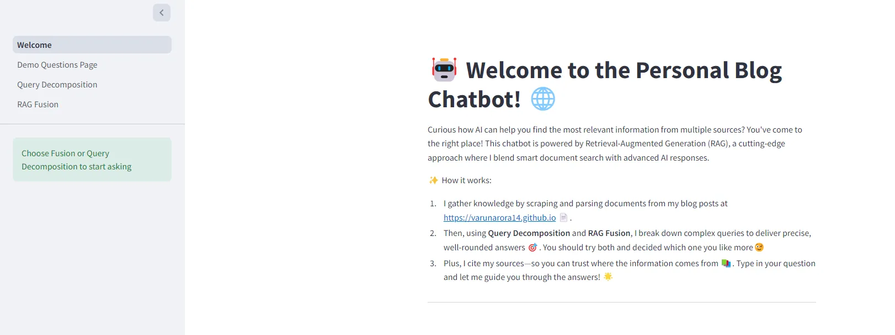

### Building RAG Chatbot on my Personal Blog

So I have been working on GenAI applications for past few months and decided to build something using RAG. I could not think of some interesting resources so I decided to take my own blog content as the data to build my RAG chatbot on.
Please note that the following content is going to be almost same as my medium blog - https://medium.com/@varunarora1408/building-rag-chatbot-on-my-personal-blog-ff89ac772c69

So, here was the rough idea that came to my mind to create this application -


Before we start with RAG, we need to actually get the data inside the vector database. For that, we need to scrape the links from websites and get their HTML data processed before putting them inside the vector database.

## Scraping

- Scrape the blogs website to get all the posts urls
- Filter duplicate urls and links not related to posts
- Store these in a pkl file to later use for vectorization

Code -

```py
import requests
from bs4 import BeautifulSoup
import re
import time
from dotenv import load_dotenv
import pickle

load_dotenv()

def getBlogLinks(url = 'https://varunarora14.github.io/'):
    source_code = requests.get(url)
    soup = BeautifulSoup(source_code.content, 'lxml')
    data = []
    links = []

    def remove_duplicates(l): # remove duplicates and unURL string
        for item in l:
            match = re.search("(?P<url>https?://[^\s]+)", item)
            if match is not None:
                links.append((match.group("url")))

    for link in soup.find_all('a', href=True):
        data.append(str(link.get('href')))

    # print(data)
    flag = True
    remove_duplicates(data)
    while flag:
        try:
            for link in links:
                for j in soup.find_all('a', href=True):
                    temp = []
                    source_code = requests.get(link)
                    soup = BeautifulSoup(source_code.content, 'lxml')
                    temp.append(str(j.get('href')))
                    remove_duplicates(temp)

                    # breaking loop in case links count very high for blogs leading to google sites
                    if len(links) > 162: # set limitation to number of URLs
                        break
                if len(links) > 162:
                    break
            if len(links) > 162:
                break
        except Exception as e:
            print(e)
            if len(links) > 162:
                break

    uniqueLinks = list(set(links))
    # extract only posts
    blogLinks = [link for link in uniqueLinks if "varunarora14.github.io/posts/" in link]
    with open('blog_urls.pkl', 'wb') as f:
        pickle.dump(blogLinks, f)

# getBlogLinks()
```

---

## Data Chunking and Vectorization

- For loading HTML websites, I used langchain’s **AsyncHtmlLoader** and **RecursiveCharacterTextSplitter** for splitting documents to chunks. Chunking helps to make contexts smaller which helps them fit in LLM’s context windows
- **Html2TextTransformer** was used to remove HTML tags to clean each document chunk and empty chunks(empty due to tags removal) are filtered out. The remaining chunks/docs are stored in pkl file to load in vector DB
- Hugging Face embedding function **all-MiniLM-L6-v2** is used for creating vectors of each chunk and stored in **FAISS** vector database (I definitely think the embedding function can improve next time)

Code -

```py
import pickle
from langchain_community.document_loaders import AsyncHtmlLoader
from langchain_text_splitters import RecursiveCharacterTextSplitter
from langchain_community.document_transformers import Html2TextTransformer
from langchain_community.embeddings.sentence_transformer import SentenceTransformerEmbeddings
from langchain.vectorstores import FAISS


def storeBlogDocs():
    with open('blog_urls.pkl', 'rb') as f:
        links = pickle.load(f)

    loader = AsyncHtmlLoader(links)
    splitter = RecursiveCharacterTextSplitter(chunk_size=1000, chunk_overlap=200)
    docs = loader.load_and_split(splitter)

    html2text = Html2TextTransformer()
    docsTransformed = html2text.transform_documents(docs)
    len(docsTransformed)

    # for i,d in enumerate(docsTransformed):
    #     if d.page_content == "\n":
    #         print(i)

    # ignore html data without any important information which have empty page content
    filteredDocs = [d for d in docsTransformed if d.page_content!='\n']
    print("len of filtered docs:", len(filteredDocs))

    with open('filtered_blog_docs.pkl', 'wb') as f:
        pickle.dump(filteredDocs, f)


# def embedDocumentsToFaiss():

def createVectorDatabase():
    # can replace with - BAAI/bge-base-en-v1.5
    embedding_function = SentenceTransformerEmbeddings(model_name="all-MiniLM-L6-v2")
    with open('filtered_blog_docs.pkl', 'rb') as f:
        filteredDocs = pickle.load(f)

    vstore = FAISS.from_documents(documents=filteredDocs, embedding=embedding_function)

    # save vectordb locally
    vstore.save_local(folder_path="faissdb_1000", index_name="blog")
```

---

## RAG

Now, for performing RAG, I decided to use 2 advanced techniques — **Query Decomposition** and **RAG Fusion**. The reason being RAG Fusion is quite fast and gives good quality responses while Query Decomposition seems to give me best quality responses taking more time, so why not implement both?


For each user question, we first validate the question using custom class called **LLMResponse** which inherits from Pydantic where we tell LLM to classify whether the user question is related to our blog content or not. It then uses the field **errorMessage** of the response to decide whether it is valid or not. Refer to this part again in the code.

The next step is RAG pipeline. Here is the flow -

- **Generate multiple queries** from initial user question
- Filter those queries to remove empty data that LLM might give
- Do **similarity search** for each generated query and **combine the documents retrieved in a list**
- Now perform documents **re-ranking** using **reciprocal rank fusion** where highest and most occuring docs are ranked higher than others
- Pass these re-ranked documents as context to LLM with initial user question and get response
- Parse the response in JSON format which contains **question**, **answer** and **sources** where sources are **blog urls** from which the answer has been generated.

Code -

```py
import os
from dotenv import load_dotenv
from langchain_google_genai import ChatGoogleGenerativeAI
from langchain.prompts import PromptTemplate
from langchain_core.output_parsers import StrOutputParser
from langchain.load import loads, dumps
from langchain_community.embeddings.sentence_transformer import SentenceTransformerEmbeddings
from langchain_core.runnables import RunnableParallel, RunnablePassthrough
from langchain.vectorstores import FAISS
from pydantic import BaseModel, AfterValidator, Field, ValidationError
import instructor
import google.generativeai as genai

load_dotenv()

genai.configure(api_key=os.environ["GOOGLE_API_KEY"])
client = instructor.from_gemini(
client=genai.GenerativeModel(
    model_name="models/gemini-1.5-flash-latest",  # model defaults to "gemini-pro"
),
mode=instructor.Mode.GEMINI_JSON,
)

class LLMResponse(BaseModel):
    question: str
    isValidResponse: bool = Field(description="True if the answer is related to Kubernetes, AWS, linux, docker, networking or it's related topics, False otherwise")

def initGeminiLLM():
    GOOGLE_API_KEY = os.environ["GOOGLE_API_KEY"]
    llm = ChatGoogleGenerativeAI(model="gemini-1.5-flash-latest", temperature=0.5, max_retries=3)
    return llm

def loadVectorDB(folder_path):
    embedding_function = SentenceTransformerEmbeddings(model_name="all-MiniLM-L6-v2")
    vstore2 = FAISS.load_local(folder_path=folder_path, index_name="blog", embeddings=embedding_function, allow_dangerous_deserialization=True)
    return vstore2

def filterQueries(queries):
    filtered_queries = [d.strip() for d in queries if d.strip()!='']
    print("filtered queries:", filtered_queries)
    print("len of filtered queries:", len(filtered_queries))
    return filtered_queries if len(filtered_queries)<=3 else filtered_queries[-3:] # last elements

def getMultiQueryChain(llm):
    multi_question_template = """
    You are an AI assistant and your task is to generate three different versions of the given question to retrieve relevant documents from a vector database. By generating the multiple perspectives on the user question, your goal is to help the user overcome some of the limitations of distance based similarity search.
    Provide these alternative questions separated by newlines and do not generate any extra result other than the alternate questions.

    Question: {question}
    """

    multi_question_prompt = PromptTemplate(template=multi_question_template, input_variables=["question"])
    generate_multi_queries = multi_question_prompt | llm | StrOutputParser() | (lambda x: x.split("\n"))
    return generate_multi_queries

def reciprocalRankFusion(results: list[list], k=60):
    fused_scores = {}

    for docs in results:
        for rank, doc in enumerate(docs):
            doc_str = dumps(doc)
            if doc_str not in fused_scores:
                fused_scores[doc_str] = 0
            previous_score = fused_scores[doc_str]
            fused_scores[doc_str] += 1 / (rank + k)

    # No need to send scores for using docs as context
    reranked_results = [
        loads(doc)
        for doc, score in sorted(fused_scores.items(), key=lambda x: x[1], reverse=True)
    ]

    # Return the reranked results as a list of tuples, each containing the document and its fused score
    return reranked_results

def getMultiQueryDocs(llm, retriever, question:str):
    print("initial question:", question)
    generate_multi_queries = getMultiQueryChain(llm=llm)
    retrieval_chain = generate_multi_queries | filterQueries | retriever.map() | reciprocalRankFusion
    return retrieval_chain.invoke(question)

def parseConversationalFusion(conversation):

    # print(conversation)
    user_query = conversation["data"]["question"]
    llm_answer = conversation["answer"]
    sources = set()

    mapper = {}

    for doc in conversation["data"]["context"]:
        if doc.metadata["source"] not in mapper:
            mapper[doc.metadata["source"]]=0
        mapper[doc.metadata["source"]]+=1

    sourceMappings = sorted(mapper.items(), key=lambda x: x[1], reverse=True)
    print(sourceMappings)
    sources = [s[0] for s in sourceMappings][:4] # top 4 sources
    print(sources)


    res = {
        "question": user_query,
        "answer": llm_answer,
        "sources": sources
    }
    return res

def getFusionLLMResponse(llm, retriever, question:str):
    validatorResponse = None
    try:

        validatorResponse = client.chat.completions.create(
        response_model=LLMResponse,
        messages=[
            {"role": "user", "content": f"Validate the question:  `{question}`"}
        ]
    )
    except ValidationError as ve:
        obj = LLMResponse()
        obj.question = question
        obj.isValidResponse = False
        obj.errorMessage = "Sorry, your query is not related to any of the blog contents"
        validatorResponse = obj
        print("Validation error:", str(ve))

    if not validatorResponse.isValidResponse:
        resp = {
            "question": question,
            "isValidResponse": validatorResponse.isValidResponse,
            "errorMessage": "Sorry, your query is not related to any of the blog contents"
        }
        return resp
    prompt_template = """
    You are a technical expert assisting with descriptive  answers based on provided tech blog content. Carefully analyze the context retrieved from the blog to answer the following question with precision. If the context includes relevant code snippets, provide them exactly as presented. When the context doesn't contain an answer, give a response based on your own knowledge. Be concise, but thorough, prioritizing accuracy from the documents. Clearly distinguish between information from the context and your own knowledge if used."

    Context:
    {context}

    Question:
    {question}"""

    prompt = PromptTemplate(template=prompt_template, input_variables=["context", "question"])

    def formatDocs(docs):
        return  "\n\n".join(doc.page_content for doc in docs)

    rag_chain_from_docs = (
        {
            "context": lambda x: formatDocs(x["data"]["context"]),
            "question": lambda x: x["data"]["question"]
        }
        | prompt
        | llm
        | StrOutputParser()
    )

    rag_chain_with_source = RunnableParallel(
        {"data": RunnablePassthrough()}
    ).assign(answer=rag_chain_from_docs)

    res = rag_chain_with_source.invoke({
        "context": getMultiQueryDocs(llm=llm, retriever=retriever, question=question),
        "question": question
    })

    return parseConversationalFusion(res)
    # return res


llm = initGeminiLLM()
print("llm initiated")


vstore2 = loadVectorDB(folder_path="RAG/faissdb_1000")
print("vector store loaded")
user_question = "What is are statefulsets and volumes? Give code for same"
retriever2 = vstore2.as_retriever()
print(getFusionLLMResponse(llm=llm, retriever=retriever2, question=user_question))
```

---

### Query Decomposition RAG


For each user question, we first validate the question using custom class called **LLMResponse** which inherits from Pydantic where we tell LLM to classify whether the user question is related to our blog content or not. It then uses the field **errorMessage** of the response to decide whether it is valid or not. Refer to this part again in the code.

The next step is RAG pipeline. Here is the flow -

- **Generate multiple queries** from initial user question
- Filter those queries to remove empty data that LLM might give
- Now, for each **sub-query**, perform native RAG call and store it’s source urls inside **sources_list** array.
- Store each **subQuestion** and **subQuestionAnswer** in another list which will be used now as context
- Function **format_qa_pairs** takes the above list of questions and answers and formats them as they will be used as context to RAG instead of document chunks.
- The sources urls are put in list and are passed through **re-ranking** using **custom Reciprocal Rank Fusion (RRF)** to rank sources based off occurences and order of occurences. Top 4 of these sources are sliced to be sent for answer
- RAG chain is called with **new context created via format_qa_pairs** and initial question passed and this LLM generated response is stored.
- The question, LLM response and source urls are then converted in dictionary object to return as response when function **queryDecompostionRAG** is called.

Code -

```py
import os
from dotenv import load_dotenv
from langchain_google_genai import ChatGoogleGenerativeAI
from langchain.prompts import PromptTemplate
from langchain_core.output_parsers import StrOutputParser
from langchain.load import loads, dumps
from langchain_community.embeddings.sentence_transformer import SentenceTransformerEmbeddings
from langchain_core.runnables import RunnableParallel, RunnablePassthrough
from langchain.vectorstores import FAISS
from pydantic import BaseModel, AfterValidator, Field, ValidationError
import instructor
import google.generativeai as genai

load_dotenv()

genai.configure(api_key=os.environ["GOOGLE_API_KEY"])
client = instructor.from_gemini(
client=genai.GenerativeModel(
    model_name="models/gemini-1.5-flash-latest",  # model defaults to "gemini-pro"
),
mode=instructor.Mode.GEMINI_JSON,
)

class LLMResponse(BaseModel):
    question: str
    isValidResponse: bool = Field(description="True if the answer is related to Kubernetes, AWS, linux, docker, networking or it's related topics, False otherwise")

def initGeminiLLM():
    GOOGLE_API_KEY = os.environ["GOOGLE_API_KEY"]
    llm = ChatGoogleGenerativeAI(model="gemini-1.5-flash-latest", temperature=0.5, max_retries=3)
    return llm

def loadVectorDB(folder_path):
    embedding_function = SentenceTransformerEmbeddings(model_name="all-MiniLM-L6-v2")
    vstore2 = FAISS.load_local(folder_path=folder_path, index_name="blog", embeddings=embedding_function, allow_dangerous_deserialization=True)
    return vstore2

def filterQueries(queries):
    filtered_queries = [d.strip() for d in queries if d.strip()!='']
    print("filtered queries:", filtered_queries)
    print("len of filtered queries:", len(filtered_queries))
    return filtered_queries if len(filtered_queries)<=3 else filtered_queries[-3:] # last elements

def getMultiQueryChain(llm):
    multi_question_template = """
    You are an AI assistant and your task is to generate three different versions of the given question to retrieve relevant documents from a vector database. By generating the multiple perspectives on the user question, your goal is to help the user overcome some of the limitations of distance based similarity search.
    Provide these alternative questions separated by newlines and do not generate any extra result other than the alternate questions.

    Question: {question}
    """

    multi_question_prompt = PromptTemplate(template=multi_question_template, input_variables=["question"])
    generate_multi_queries = multi_question_prompt | llm | StrOutputParser() | (lambda x: x.split("\n"))
    return generate_multi_queries

def formatDocs(docs):
        return  "\n\n".join(doc.page_content for doc in docs)

def reciprocalRankFusionSources(results: list[list], k=60):
    '''
    Pass all the sources and sort in order of most occuring sources
    '''
    fused_scores = {}

    for sources in results:
        for rank, source in enumerate(sources):
            if source not in fused_scores:
                fused_scores[source] = 0
            fused_scores[source] += 1 / (rank + k)

    # No need to send scores for using sources as context
    reranked_results = [
        sourceUrl
        for sourceUrl, score in sorted(fused_scores.items(), key=lambda x: x[1], reverse=True)
    ]

    # Return the reranked results as a list of tuples, each containing the document and its fused score
    return reranked_results[:4] # return top 3 results only

def retrieveSubquestionsRAG(question,sub_question_generator_chain, vectorStore):
    """RAG on each sub-question"""

    prompt_template = """
    You are a technical expert assisting with answers based on provided tech blog content. Carefully analyze the context retrieved from the blog to answer the following question with precision. If the context includes relevant code snippets, provide them exactly as presented. When the context doesn't contain an answer, give a response based on your own knowledge. Be concise, but thorough, prioritizing accuracy from the documents. Clearly distinguish between information from the context and your own knowledge if used."

    Context:
    {context}

    Question:
    {question}"""

    prompt = PromptTemplate(template=prompt_template, input_variables=["context", "question"])

    subQuestions = sub_question_generator_chain.invoke({"question":question})
    print("initial question: ", question)
    print("sub-questions: ", subQuestions)

    # Initialize a list to hold RAG chain results
    subqueryAnswers = []
    sources_list = []

    for sub_question in subQuestions:

        # Retrieve documents for each sub-question
        retrieved_docs = vectorStore.similarity_search(sub_question)
        print(retrieved_docs)
        sources = [d.metadata['source'] for d in retrieved_docs]
        sources_list.append(sources)

        # Use retrieved documents and sub-question in RAG chain
        subqueryAnswer = (prompt | llm | StrOutputParser()).invoke({"context": formatDocs(retrieved_docs),
                                                                "question": sub_question})
        subqueryAnswers.append(subqueryAnswer)

        rerankedSourcesFiltered = reciprocalRankFusionSources(sources_list)
    # sub-ques and answer for each sub_question is returned, both as lists
    return subqueryAnswers,subQuestions, rerankedSourcesFiltered

def format_qa_pairs(questions, answers):
    """Format Q and A pairs
    to be passed as context"""

    print("answers lens", len(answers))
    formatted_string = ""
    for i, (question, answer) in enumerate(zip(questions, answers)):
        formatted_string += f"Question {i}: {question}\nAnswer {i}: {answer}\n\n"

    print("formatted context: ", formatted_string.strip())
    return formatted_string.strip()


def queryDecompostionRAG(question, llm, vectorStore):

    validatorResponse = None
    try:

        validatorResponse = client.chat.completions.create(
        response_model=LLMResponse,
        messages=[
            {"role": "user", "content": f"Validate the question:  `{question}`"}
        ]
    )
    except ValidationError as ve:
        obj = LLMResponse()
        obj.question = question
        obj.isValidResponse = False
        obj.errorMessage = "Sorry, your query is not related to any of the blog contents"
        validatorResponse = obj
        print("Validation error:", str(ve))

    if not validatorResponse.isValidResponse:
        resp = {
            "question": question,
            "isValidResponse": validatorResponse.isValidResponse,
            "errorMessage": "Sorry, your query is not related to any of the blog contents"
        }
        return resp

    generate_multi_queries = getMultiQueryChain(llm=llm)
    sub_question_generator_chain = generate_multi_queries | filterQueries
    subqueryAnswers, subQuestions, rerankedSourcesFiltered = retrieveSubquestionsRAG(question=question, sub_question_generator_chain=sub_question_generator_chain, vectorStore=vectorStore)

    contextData = format_qa_pairs(questions=subQuestions, answers=subqueryAnswers)
    template = """Using the following set of Q&A pairs as context:

    {context}

    Synthesize a clear and comprehensive answer to the original question: "{question}".
    Ensure the answer is based on the context provided, integrating relevant information from the Q&A pairs to address the main question accurately.
    """

    prompt = PromptTemplate(template=template, input_variables=["context", "question"])

    queryDecompositionChain = (
    prompt
    | llm
    | StrOutputParser()
)
    llmAnswer = queryDecompositionChain.invoke({"context": contextData, "question": question})
    return {
        "question": question,
        "answer": llmAnswer,
        "sources": rerankedSourcesFiltered
    }

llm = initGeminiLLM()
print("llm initiated")

user_question = "What is are statefulsets and volumes? Give code for same"
vstore = loadVectorDB(folder_path="faissdb_1000")
# print("vector store loaded")

queryDecompostionRAG(question=user_question, llm=llm, vectorStore=vstore)
```

---

Now the next goal is to deploy it via Streamlit. For this we create folder .**streamlit/secrets.toml** and enter the following API keys -

```toml
HUGGINGFACEHUB_API_TOKEN = "HFACE_API_KEY"
GOOGLE_API_KEY = "GEMINI_API_KEY"
```

The hugging face API key has to retrieved from here — https://huggingface.co/settings/tokens and Gemini API key from here — https://aistudio.google.com/app/apikey

Note — **These API keys are free of cost**

After this has been done, copy the code from here — https://github.com/VarunArora14/Personal-Blog-Chatbot/tree/master/

The **app/pages** folder contains same API code as above with streamlit methods for caching and chat support making it ready to run. Refer to below example for **Query Decomposition Page**.

Code -

```py
import streamlit as st
from langchain.vectorstores import FAISS
from langchain_google_genai import ChatGoogleGenerativeAI
import os
from dotenv import load_dotenv
from langchain_community.embeddings.sentence_transformer import SentenceTransformerEmbeddings
from langchain.prompts import PromptTemplate
from langchain_core.output_parsers import StrOutputParser
from langchain.load import loads, dumps
from langchain_core.runnables import RunnableParallel, RunnablePassthrough
from pydantic import BaseModel, AfterValidator, Field, ValidationError
from typing_extensions import Annotated
import json

st.set_page_config(
    page_title="Personal Blog Chatbot",
    page_icon="🐳",
)

client,llm,vstore = None, None, None

if "llm" not in st.session_state:
    st.error("LLM NOT IN STATE! Go to Welcome and reload!")
else:
    llm=st.session_state['llm']
    client = st.session_state['client']

if "vstore" not in st.session_state:
    st.error("VSTORE NOT IN STATE! Go to Welcome and reload!")
else:
    vstore = st.session_state["vstore"]

# --------------------------------------
# QUERY DECOMPOSITION API CODE COPY PASTED
# --------------------------------------

st.markdown("""

            # 🧩 Query Decomposition: Breaking Down Complex Questions 💡

            Ever asked a question that was a bit too complex? No problem! 🤔

            With **Query Decomposition**:

            - I take **multi-part or complicated queries** and break them into **smaller, manageable sub-questions** 🔨.
            - Each sub-question is answered individually, and then I piece everything back together to provide a **complete and accurate response** 🔗.

            This approach helps ensure I cover all aspects of your question—even the tough ones—by tackling it step by step! 🎯

            Try asking something complex and see how I break it down into clear, easy-to-digest answers! 🧠

            ---


            """)

# Initialize chat history
if "decomposition_messages" not in st.session_state:
    st.session_state.decomposition_messages = []

# Display chat messages from history on app rerun
for message in st.session_state.decomposition_messages:
    with st.chat_message(message["role"]):
        st.markdown(message["content"])

# Accept user input
if prompt := st.chat_input("What is up?"):
    # Add user message to chat history
    st.session_state.decomposition_messages.append({"role": "user", "content": prompt})
    # Display user message in chat message container
    with st.chat_message("user"):
        st.markdown(prompt)

    # Display assistant response in chat message container
    with st.chat_message("assistant"):
        if len(st.session_state.decomposition_messages):
            response = queryDecompostionRAG(question=st.session_state.decomposition_messages[-1]["content"], llm=llm, vectorStore=vstore)
            answer = None
            if response["isValidResponse"]==False:
                answer = response["errorMessage"]
            else:
                answer = response['answer'] + "\n\nSource: " + ", ".join(x for x in response['sources'])
            st.write(answer)
    st.session_state.decomposition_messages.append({"role": "assistant", "content": answer})
```

The main file to run is **app/Welcome.py** where initialisation and caching of resources also takes place. Decoratorer **st.cache_resource** makes sure the variables initialised in the methods under this decorator need not initialise again.

I used this for initialisation of my **vector database** and **LLM client** and stored them in session state for other pages to use.

Code -

```py
import streamlit as st
from langchain.vectorstores import FAISS
from langchain_google_genai import ChatGoogleGenerativeAI
import os
from dotenv import load_dotenv
from langchain_community.embeddings.sentence_transformer import SentenceTransformerEmbeddings
import instructor
import google.generativeai as genai


st.set_page_config(
    page_title="Personal Blog Chatbot",
    page_icon="🐳",
)

@st.cache_resource
def initGeminiLLM():
    # load_dotenv()
    # GOOGLE_API_KEY = os.environ["GOOGLE_API_KEY"]
    os.environ["GOOGLE_API_KEY"] = st.secrets["GOOGLE_API_KEY"]
    genai.configure(api_key=st.secrets["GOOGLE_API_KEY"])
    client = instructor.from_gemini(
    client=genai.GenerativeModel(
        model_name="models/gemini-1.5-flash-latest",  # model defaults to "gemini-pro"
    ),
    mode=instructor.Mode.GEMINI_JSON,
)

    llm = ChatGoogleGenerativeAI(model="gemini-1.5-flash-latest", temperature=0.5, max_retries=3)
    return client, llm

@st.cache_resource
def loadVectorDB(folder_path="RAG/faissdb_1000"):
    os.environ["HUGGINGFACEHUB_API_TOKEN"] = st.secrets["HUGGINGFACEHUB_API_TOKEN"]
    embedding_function = SentenceTransformerEmbeddings(model_name="all-MiniLM-L6-v2")
    vstore2 = FAISS.load_local(folder_path=folder_path, index_name="blog", embeddings=embedding_function, allow_dangerous_deserialization=True)
    return vstore2

# to be used by fusion and query decomposition
if "llm" not in st.session_state:
    st.session_state["client"], st.session_state["llm"] = initGeminiLLM()

if "vstore" not in st.session_state:
    st.session_state["vstore"] = loadVectorDB()


st.write("# 🤖 Welcome to the Personal Blog Chatbot! 🌐")

st.sidebar.success("Choose Fusion or Query Decomposition to start asking")

st.markdown(
    """
    Curious how AI can help you find the most relevant information from multiple sources? You've come to the right place! This chatbot is powered by Retrieval-Augmented Generation (RAG), a cutting-edge approach where I blend smart document search with advanced AI responses.

    ✨ How it works:

    1. I gather knowledge by scraping and parsing documents from my blog posts at https://varunarora14.github.io 📄.
    2. Then, using **Query Decomposition** and **RAG Fusion**, I break down complex queries to deliver precise, well-rounded answers 🎯. You should try both and decided which one you like more😉
    3. Plus, I cite my sources—so you can trust where the information comes from 📚.
    Type in your question and let me guide you through the answers! 🌟

    ---

    """
)
```

Now that we have gone through the core functionality, let’s run this code.

Create virtual environment at root of folder and install packages in **requirements.txt**. Confirm **secrets.toml** file exists in **.streamlit** folder.

At the root of the folder, run the command `streamlit run app/Welcome.py`

Congrats, you should have you streamlit app running. I have put the vectorDB and APIs part of same folder to make it easy to deploy on streamlit.

Here is my deployed website — https://personal-blog-chatbot.streamlit.app/

These are screenshots of the app -

_home page_


---

_RAG fusion question — Gives source urls from my blog_


---

_Query decomposition question answered with sources_


Refer to the source code repo here — https://github.com/VarunArora14/Personal-Blog-Chatbot

Do go through my blogs if you are interested a bit more in Kubernetes, AWS or linux commands — https://varunarora14.github.io

Please let me know if you have any doubts. You can connect with me on linkedin here — https://www.linkedin.com/in/varun-arora-335225192/

Glad you have reached till here. Happy reading!
