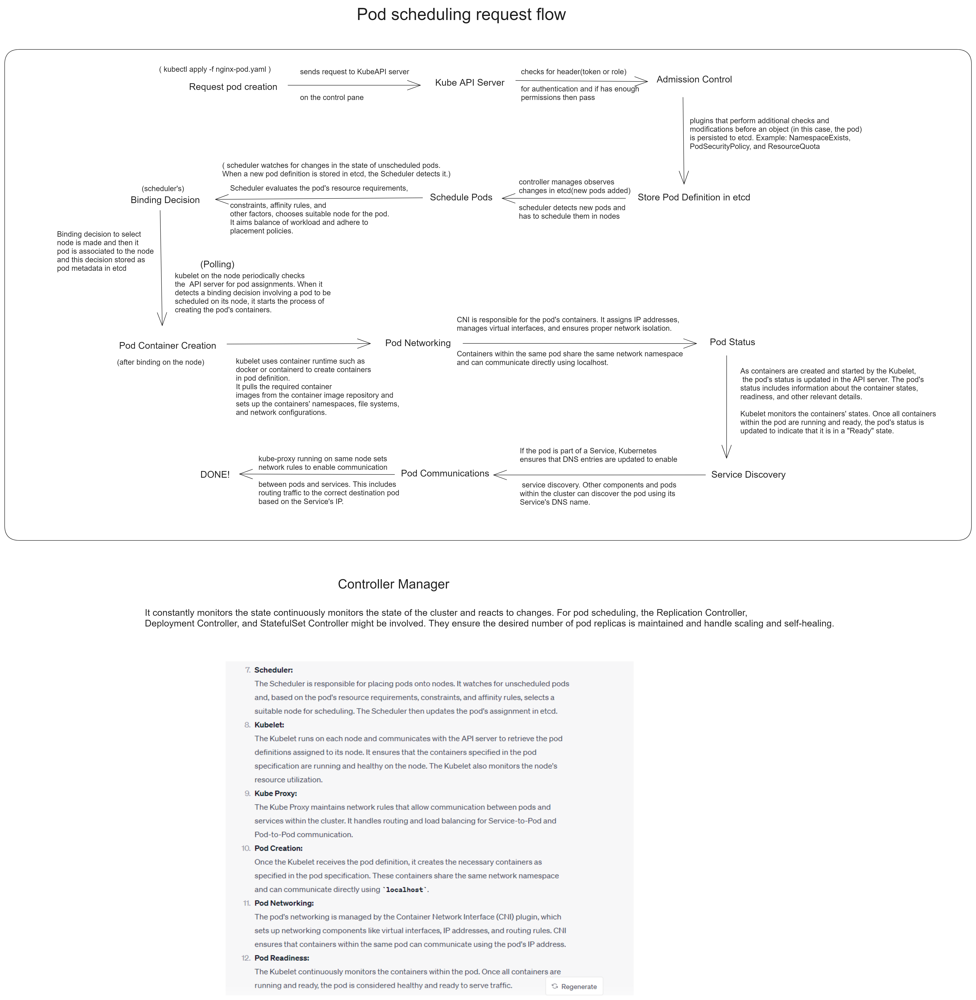

### Pod Scheduling Flow in Kubernetes

_Open above image in new tab_

---

Pod scheduling is a core component of Kubernetes that manages how and where pods are placed across the cluster's available nodes. The process ensures that each pod meets its requirements, such as resource allocation (CPU, memory), affinity rules, and node availability. Let’s break down the pod scheduling request flow, along with key details based on the provided diagram and Kubernetes principles.

---

#### 1. **Request Pod**

The pod scheduling process begins when a user or the system requests a new pod creation, typically through a `kubectl` command (e.g., `kubectl apply -f nginx-pod.yaml`). This request is sent to the **Kube API Server**, which orchestrates communication across various Kubernetes components.

---

#### 2. **Kube API Server**

The **Kube API Server** performs the following:

- **Authentication & Authorization**: Verifies whether the requestor has the required permissions to create the pod.
- **Admission Control**: Runs admission plugins that enforce policies, such as resource limits, security context, and namespace quotas.
- If all checks are passed, the pod object is accepted and stored in **etcd** (Kubernetes' key-value store), which acts as the central data repository.

---

#### 3. **Binding Decision**

The **Scheduler** component watches for unscheduled pods and initiates the binding process. The scheduler's job is to find a suitable node where the pod can run, based on several factors:

- **Resource requirements**: CPU, memory, etc.
- **Constraints & Policies**: Node selectors, taints/tolerations, affinity/anti-affinity rules.
- **Node Health**: Ensures the selected node is running and capable of handling the workload.

If the scheduler finds an appropriate node, it makes a **binding decision**, linking the pod to a specific node. This decision is stored in the system, and the pod is scheduled for creation.

---

#### 4. **Pod Container Creation**

Once a pod is bound to a node, the **kubelet** (node agent) on that node begins creating containers for the pod based on its specification. This includes:

- Pulling images from container registries.
- Setting up namespaces (network, process, file system).
- Initializing container storage and resource allocation.

---

#### 5. **Pod Networking**

Once the pod is created, **Container Network Interface (CNI)** plugins handle networking. CNI:

- Sets up virtual interfaces, IP addresses, and routing.
- Ensures containers in the same pod communicate through `localhost`.
- Allows pods across different nodes to communicate within the cluster network.

---

#### 6. **Pod Communications**

Pods communicate with other services and applications. Kubernetes handles this with:

- **Kube-proxy**: Sets up network rules for service-to-pod communication and load balancing.
- **Service Discovery**: If the pod is part of a service, DNS entries are configured to allow other pods to discover it.

---

#### 7. **Pod Status**

The **kubelet** monitors the pod's status and communicates it back to the API Server:

- **Running**: Once containers are initialized, the pod is marked as "Ready."
- **Failing**: If containers fail to start, the kubelet reports errors for corrective action.

---

#### 8. **Controller Manager**

The **Controller Manager** constantly monitors the state of the cluster to react to changes:

- Ensures the desired number of pod replicas are running.
- Handles scaling, failovers, and rescheduling if nodes fail.
- Components like the **Replication Controller** and **Deployment Controller** help maintain the application's desired state.

---

### Key Components in Pod Scheduling

1. **Kube API Server**: Coordinates communication between clients and the Kubernetes cluster.
2. **Scheduler**: Assigns pods to nodes based on available resources and scheduling policies.
3. **Kubelet**: Runs on each node to manage pods, ensuring their containers are running and healthy.
4. **CNI (Container Network Interface)**: Manages networking for pods, including assigning IPs and setting up routes.
5. **kube-proxy**: Handles communication between services and their backend pods.

---

### Conclusion

Pod scheduling is a critical part of Kubernetes that involves resource allocation, placement, and ensuring that pods can communicate with other services within the cluster. The process is highly dynamic, and the Kubernetes scheduler continuously monitors node health and resource availability to maintain the desired state of the cluster. By automating these complex tasks, Kubernetes ensures that applications remain resilient, scalable, and efficiently deployed across distributed systems.
