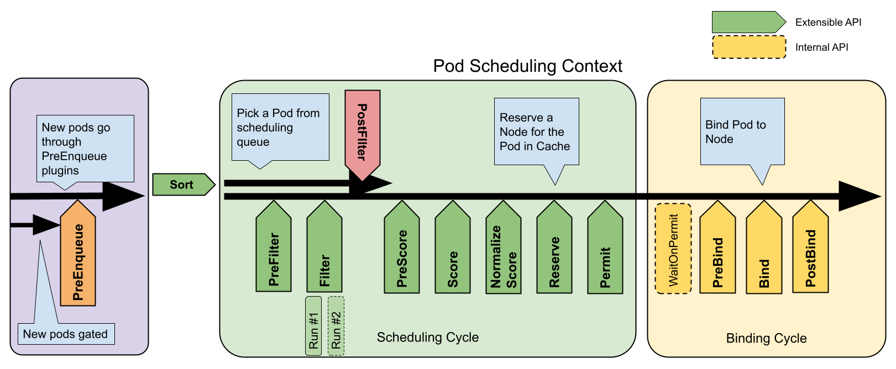

#### pod priority via their yaml - 

```yml
    preemptionPolicy: PreemptLowerPriority
    priority: 0
```

https://kubernetes.io/docs/concepts/scheduling-eviction/pod-priority-preemption/

**Priority class** - non-namespaced object that defines a mapping from a priority class name to the integer value of the priority. They are used to prioritize pods to be scheduled before and come with

```yml
apiVersion: scheduling.k8s.io/v1
kind: PriorityClass
metadata:
  name: high-priority
value: 1000000
globalDefault: false
description: "This priority class should be used for XYZ service pods only."
```

(`preemptionPolicy: PreemptLowerPriority` is default)

**Non-preempting class** example -

```yml
apiVersion: scheduling.k8s.io/v1
kind: PriorityClass
metadata:
  name: high-priority-nonpreempting
value: 1000000
preemptionPolicy: Never
globalDefault: false
description: "This priority class will not cause other pods to be preempted."
```

Pod with priority-class

```yml
apiVersion: v1
kind: Pod
metadata:
  name: nginx
  labels:
    env: test
spec:
  containers:
    - name: nginx
      image: nginx
      imagePullPolicy: IfNotPresent
  priorityClassName: high-priority
```

**Non-preemption** - it is set via **preemptionPolicy**: **Never** => pods with higher priority and this policy **cannot preempt(evict low priority pod from node for higher priority to be scheduled)**. Although, these pods can be **preempted by higher priority pods**.

**Default policy**: **PreemptLowerPriority**, allows pods of that priority class to preempt lower priority pods, if is Never, pods will be non-preempting.

Example: Data science workload - A job to be prioritized over other workloads but do not discard existing by preempting other pods. This high priority pod with preemptionPolicy: Never, will be scheduled ahead of other queued pods.

This is useful if scheduler cannot schedule a pod to any node which goes in pending, preemption logic finds node where removal of low priority pods would enable new pod P to be scheduled and so those pods are evicted from node.

**Note** -

Pod priority and QoS class are two orthogonal features with few interactions and no default restrictions on setting the priority of a Pod based on its QoS classes. The scheduler's preemption logic does not consider QoS when choosing preemption targets. Preemption considers Pod priority and attempts to choose a set of targets with the lowest priority. Higher-priority Pods are considered for preemption only if the removal of the lowest priority Pods is not sufficient to allow the scheduler to schedule the preemptor Pod, or if the lowest priority Pods are protected by PodDisruptionBudget

**Pod Overhead**

When you run a Pod on a Node, the Pod itself takes an amount of system resources. These resources are additional to the resources needed to run the container(s) inside the Pod. Pod overhead accounts for these. You need to make sure a RuntimeClass is utilized which defines the overhead field.

Refer to code for runtime and pod - https://kubernetes.io/docs/concepts/scheduling-eviction/pod-overhead/

Runtime Class -

```yml
apiVersion: node.k8s.io/v1
kind: RuntimeClass
metadata:
  name: kata-fc
handler: kata-fc
overhead:
  podFixed:
    memory: "120Mi"
    cpu: "250m"
```

Pod -

```yml
apiVersion: v1
kind: Pod
metadata:
  name: test-pod
spec:
  runtimeClassName: kata-fc
  containers:
    - name: busybox-ctr
      image: busybox:1.28
      stdin: true
      tty: true
      resources:
        limits:
          cpu: 500m
          memory: 100Mi
    - name: nginx-ctr
      image: nginx
      resources:
        limits:
          cpu: 1500m
          memory: 100Mi
```

Run this on the node where the Pod is scheduled.# Also, change the name of the cgroup to match the cgroup allocated for your pod.
`cat /sys/fs/cgroup/memory/kubepods/podd7f4b509-cf94-4951-9417-d1087c92a5b2/memory.limit_in_bytes`

## Scheduling Framework

Scheduling framework and working - https://kubernetes.io/docs/concepts/scheduling-eviction/scheduling-framework/


