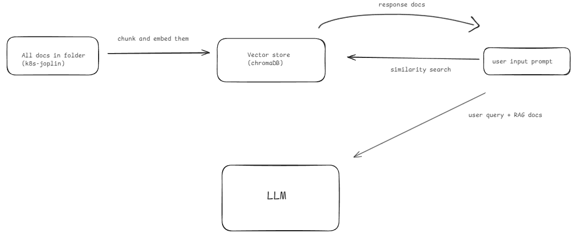
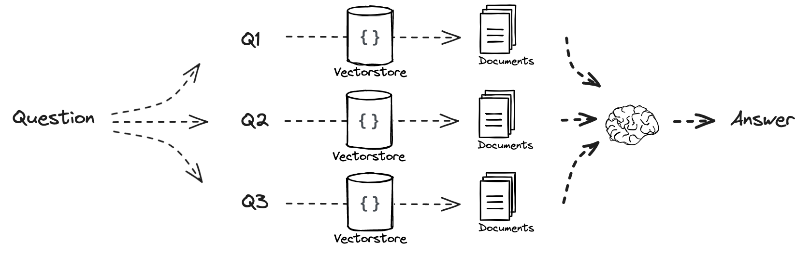
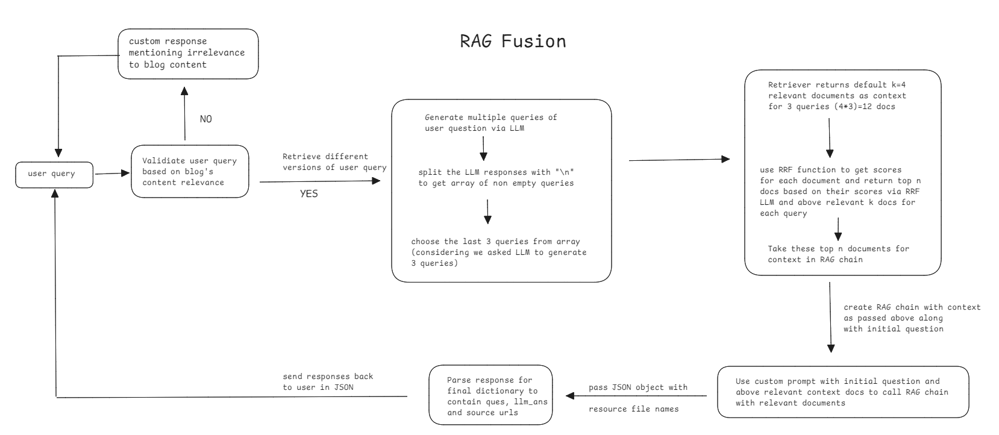
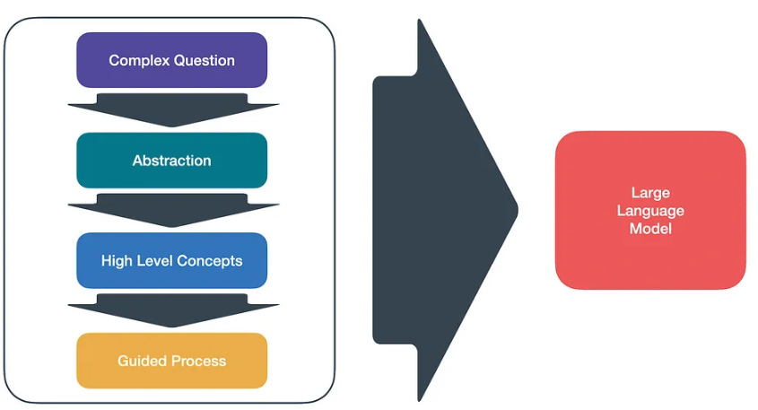
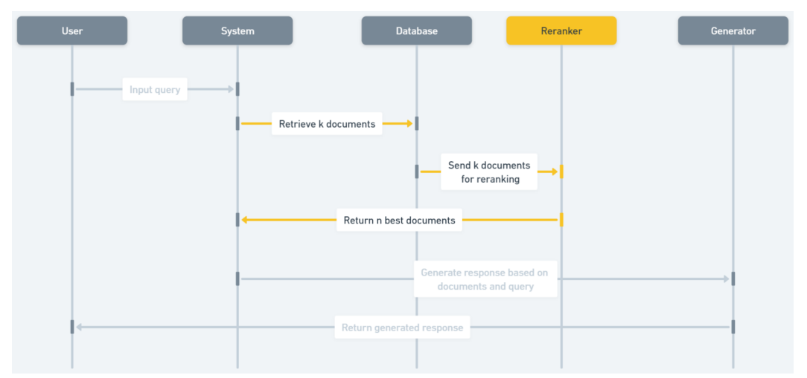
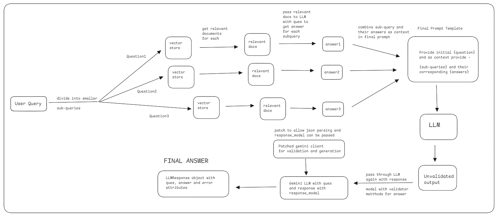
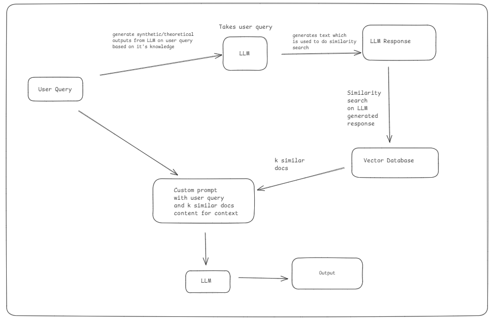
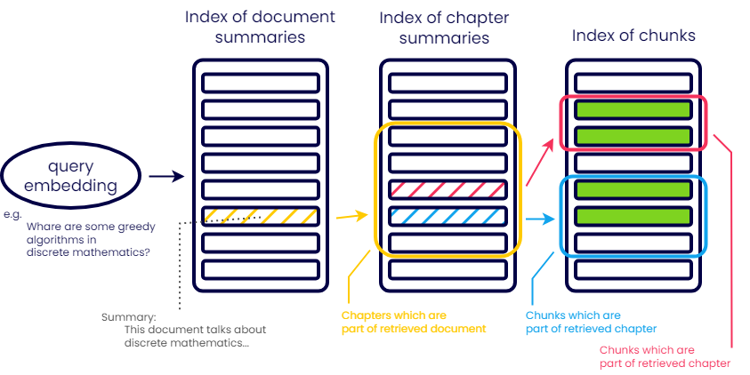

There exist quite a number of RAG techniques aiming to improve chatbot systems to have better accuracy and relevance to questions being asked. Some of the popular techniques are -

- RAG Fusion
- Multi query
- Native RAG
- Stepback prompting
- Hierarchical indexes
- Document summary index + LLM rerank
- HyDe
- Query decomposition

Refer to research paper with different RAG techniques compared are graded - https://arxiv.org/pdf/2404.01037

Here is how they compare to each other and what are the benefits and problems of each technique being used for implementing RAG based systems.

---

### Native RAG

Working -

- Chunk the data and store inside a vector database
- User asks a question and relevant chunks are retrieved
- These chunks are used as context in a prompt with user question and passed to LLM to generate answer
- LLM gives answer to user

Problems -

- Does not give good answers when question is quite complex or the question has tokens which may have meaning that certain chunks might have but they are not semantically similar
- Cannot give better quality answers for questions which simply are not semantically similar to the data

---

### Multi Query RAG

- Improvement to Native RAG for scenarios where we want **better semantic relations of question to chunks in vector store**
- Generates multiple variations of a query to retrieve a broader range of context, often increasing the likelihood of getting relevant information.

**Problems** -

- High dependence on queries generated by LLM to be semantically close to data in vector store and less accuracy due to this probabilistic variation. Can also introduce irrelevant information
- No way to filter chunks in their order of occurence. It should have some reranking mechanism so we can choose the highest ranked/most occuring chunks in terms of similarity score which decides which chunk to use as context.
- Has higher time to run as multiple queries require to be generated and handled
- Sub-queries generated do not have any guarantee of reproducibility which leads to quite variety of answers for same questions making it inconsistent.

**Benefits** -

- Help retrieve diverse pieces of information, reducing risk to lose information due to ambiguity in initial query
- Better recall in cases when same answer can be rephrased in different ways

---

### RAG Fusion

A better implemented version of multi-query with **ranking** of relevant documents retrieved via similarity search.

Problems -

- Like multi-query, **high dependence of sub-queries** generated that decide the quality of answer which may lead to **lack of cohesion** in final response
- **Low accuracy and reproducibility but high variation in the answer quality/content** leading to the technique being less **reliable** for systems expected to be consistent in their responses
- **Complex to implement the fusion logic** for documents and how sub-questions are extracted and handled
- **High latency** to generate final response like **Multi Query**

Benefits -

- Answers are in-depth in nature focusing on smaller and manageable parts of the question
- Enhances the quality of answers by making them **detailed and relevant to question**

---

### Stepback Prompting

This makes a much more abstract version of the user query so it can help similarity search of questions where user asks very specific data.
This aims at solving problems where a question is very detailed and complex and it is better to provide an **abstract question and context related to that question whole as context while generating answer to the user question**.

**Problems** -

- Making an abstract version of a question does not guarantee better similarity search and may provide vague context.
- High dependence on stepback query for answer quality.
- Not useful in generic question-answering scenarios but specific use cases only.

**Benefits** -

- Useful in scenarios where additional context generated via stepback query can help improve answers using that context(Reference -https://cobusgreyling.medium.com/a-new-prompt-engineering-technique-has-been-introduced-called-step-back-prompting-b00e8954cacb)

---

### Document summary index + LLM rerank

In cases where we have a lot of pdf data and NOT structured data.

- parse the PDFs for text ONLY
- chunk and split the pdfs using langchain/llamaindex
- Now replace the `page_content` of each `Document()` object by the summary of the page_content generated by the LLM
- For each question, retrieve `k` similar docs and then use LLM to re-rank the documents using LLMs which decides relevance of summary with respect to the user query

Problems -

- **Not helpful for structured data** in SQL, csv or JSON data as their summaries do not make sense
- Summarization may **remove critical information** that would have been useful in the final answer
- **Ranking summaries can be complex** especially when considering **specialised/domain specific topics**
- Summarization is **costly** to implement and time consuming, leading to **potential increase in cost and latency**(for LLM rerank)

It overall has decent quality of accuracy and consistent responses but is expensive to setup.

---

### Query Decomposition

Working -

- This method requires the LLM to break down the question into small sub-questions
- Extract sub-questions from LLM response and then generate answer of each question using Native RAG inside this techniques
- Then pass the initial question and context Question-Answer pairs that were generated as context with initial question to generate final answer to be sent to user

**Problems** -

- Difficult to implement as it requires queries extraction and then combining multiple answers together as context. **Combining sub-answers to a cohesive answer** can be challenging.
- Gives detailed answers where the answers might be much extra than what is expected or asked for. Such detailed answers might not be liked for simple questions and make more sense of complex questions or questions with multiple sub-questions in them
- **High latency and cost** for computation(sub-queries and their responses have to be generated as well. More LLM calls means higher cost)

**Benefits** -

- **Better retrieval for multi-faceted questions** where distinct answers are required for differents parts of the question
- Has **increased accuracy** with each sub-query to retrieve highly relevant information for it's part of question

---

### HyDe

It works by generating hypothetical answer based off knowledge of LLM and then use it for similarity search in attempt that tokens generated via this technique will be semantically closer to chunk data.
HyDe generates synthetic (hypothetical) embeddings based on the query and retrieves documents that are semantically similar to these embeddings rather than relying on existing documents in vector database.

Problems -

- LLM response for **hypothetical documents** might be **irrelevant or not completely aligned towards the data in vector database** leading to risk of **hallucination**. This technique will fail if data in vector DB is not at all existing in outside world(ex: company documentations or domain specific private research data) based on which LLM was trained leading to hallucinated answers.
- Additional computation and cost is added for generating hypothetical documents leading to **higher latency**
- Hard to setup right embedding strategy for diverse domains of data

It works well for cases where data in vector store is quite similar to data on which LLM is trained upon. If context of data cannot be found in LLM response, then quality of answers will be bad.

---

### Hierarchical Indexes

This works by creating the chunks of textual data and creating `Document()` objects of it. Then we will create summaries of each of these chunks and using the document schema of each chunk, we replace the `page_content` with **generated summary of the chunk**.
Then we use the summary for similarity search for the **first layer of search**. Then after we got those documents, we take each document and search again using same user query, this time with **filter** of the **page_number/filename** so we can point to exact chunk.

This kind of technique makes sense for **large amounts of data** to be filtered via it's **metadata** so we point to the right source chunk which we will use as context.
In basic scenarios, we need 2 layers but this can be more for complex scenarios with better metadata filtering as well.

Problems -

- This only makes sense for large amounts of data as maintaining multiple indexes and search is time consuming and not helpful or an overkill solution for data being upto few gigabytes in size.
- Requires proper metadata mapping and storage for each chunk with proper design considerations to implement. This leads to **high complexity in system design and data management**
- Making each index is time consuming and repetitions can be costly especially when the **chunk vector store** requires changes(requires all indexes to be re-constructed)
- Slow lookup leads to **increased latency while narrowing down on chunks**, especially in **poorly optimised data structures**(that store metadata).

---

### Optimizing the RAG App

1. **For accuracy in retrieval**:

   - **Multi-query** and **Hierarchical indexes** help broaden or precisely retrieve relevant documents.
   - **Query decomposition**, **RAG fusion**, and **HyDe** enhance handling of complex queries or under-documented topics.

2. **For improved generalization and handling sparse data**:

   - **HyDe** shines in environments with sparse or incomplete document repositories, offering synthetic retrieval that goes beyond available documents.

3. **For fast and scalable retrieval**:

   - **Hierarchical indexes** help with scaling to large document collections, while **document summary with rerank** can improve precision by summarizing and sorting relevant documents quickly.
   - Avoid **multi-query** and **stepback** in latency-sensitive systems due to the added retrieval or processing steps.

4. **For handling complex, multi-part questions**:

   - **Query decomposition** and **RAG fusion** excel at breaking down queries and merging answers for complex questions. However, **HyDe** can help when the dataset lacks complete documentation.

5. **Balancing speculative answers**:
   - **HyDe** offers a valuable solution for enhancing retrieval in sparse datasets, but its use should be balanced with caution to prevent speculative or "hallucinated" responses.

---

**Note** - HyDe does not work well if data is domain specific and specialised which may not exist on data on which the LLM is trained upon. Consider company related documents or research data based on which RAG app is being created. In this scenario, HyDe generate docs might not semantically match well with data as compared to case where data in vectorDB is more generic in nature.

RAG techniques having to deal with structured data for context cannot rely on hypothetical documents to be used in intermediate steps as it might lead to answers being biased towards text chunks/data.

One way of dealing with **structured data** to be used as context would be to create another Hierarchical index over this structured data index where the Hierarchical index stores the **core meaning of the data** based on which summaries/explanation can be created which can be used as data in the index with **metadata** being stored to filter the exact chunk in the data index.

For data considering of SQL or JSON that might be huge or does not contain much information based on which these summaries/explanation can be created as Hierarchical indexes, it is a better idea to rather **create Agents that can generate queries to fetch responses from these data stored in a database**.
