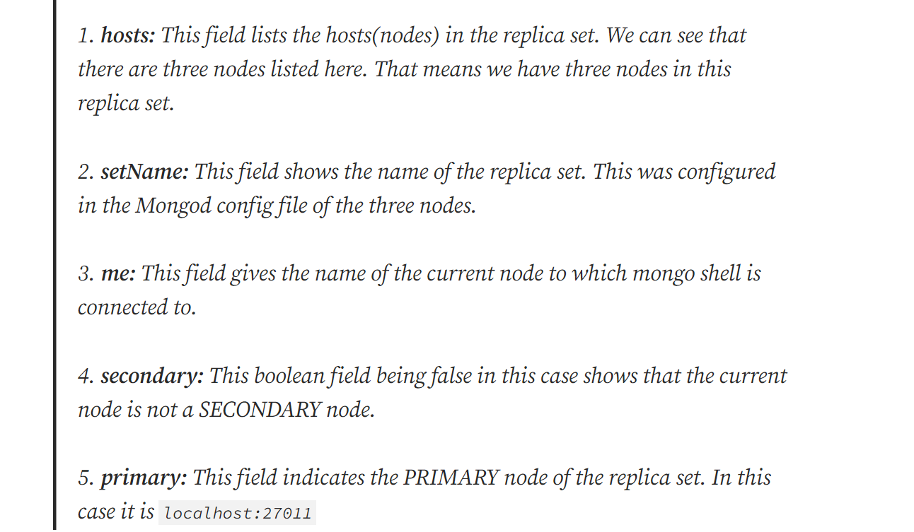

For rstarting up a 3 node cluster with 1 master and 2 slaves follow this https://medium.com/swlh/mongodb-creating-a-3-node-replica-set-cluster-7ca94849b139

First we need a **keyfile** and appropriate permissions.

**If the mongod processes were actually running on different machines, then each machine will have a copy of this keyfile.**

Use **OpenSSL** to create keyfile -

```
sudo mkdir -p /usr/local/var/mongodb/pki/
openssl rand -base64 741 > /usr/local/var/mongodb/pki/replicaset-keyfile
chmod 400 /usr/local/var/mongodb/pki/replicaset-keyfile
```

Create Mongod config files to start mongod processes. Here we will **fork** the processes to run multiple mongo.

Create and save these files
**node1.conf**

```yml
storage:
  dbPath: /usr/local/var/mongodb/node1
net:
  bindIp: localhost
  port: 27011
security:
  authorization: enabled
  keyFile: /usr/local/var/mongodb/pki/replicaset-keyfile
systemLog:
  destination: file
  path: /usr/local/var/log/mongodb/node1/mongod.log
  logAppend: true
processManagement:
  fork: true
replication:
  replSetName: replicaset-example
```

Create **dbpath** and **log** path for same

```
mkdir -p /usr/local/var/mongodb/node1
mkdir -p /usr/local/var/log/mongodb/node1
```

---

**node2.conf**

```yml
storage:
  dbPath: /usr/local/var/mongodb/node2
net:
  bindIp: localhost
  port: 27012
security:
  authorization: enabled
  keyFile: /usr/local/var/mongodb/pki/replicaset-keyfile
systemLog:
  destination: file
  path: /usr/local/var/log/mongodb/node2/mongod.log
  logAppend: true
processManagement:
  fork: true
replication:
  replSetName: replicaset-example
```

```
mkdir -p /usr/local/var/mongodb/node2
mkdir -p /usr/local/var/log/mongodb/node2
```

---

**node3.conf**

```yml
storage:
  dbPath: /usr/local/var/mongodb/node3
net:
  bindIp: localhost
  port: 27013
security:
  authorization: enabled
  keyFile: /usr/local/var/mongodb/pki/replicaset-keyfile
systemLog:
  destination: file
  path: /usr/local/var/log/mongodb/node3/mongod.log
  logAppend: true
processManagement:
  fork: true
replication:
  replSetName: replicaset-example
```

```
mkdir -p /usr/local/var/mongodb/node3
mkdir -p /usr/local/var/log/mongodb/node3
```

---

**Now launch the 3 mongod processes by following commands -**

```
mongod -f node1.conf
mongod -f node2.conf
mongod -f node3.conf
```

Do `netstat -tulnp` to check them if they are running.

---

## Connect and Add replicas in Replica Set

`mongosh --port 27011`

Inside it, run command,

```
rs.initiate(); // to initiate the replica set
use admin;     //switch to admin database for creating root user
db.createUser({
 user: "test-user",
 pwd: "test-pass",
 roles: [{ role: "root", db: "admin"}]
});
```

Here we **password protect** the database and assign **role** as well.

---

Now disconnect by ctrl+c and login to replica by credentials u entered as -
`mongo --host "replicaset-example/localhost:27011" -u "test-user" -p "test-pass" --authenticationDatabase "admin"`

The **master** in replica is the **only** that recieves **read/write** and is called the **Primary**.
(Learn about running is **master mode** and other things as well in Documentation)

Check using command `rs.isMaster()` to check if current is **master node** and other hosts connected as well.

To add other nodes write the command -

```
rs.add("localhost:27012") //to add second node running on port 27012
rs.add("localhost:27013") //to add third node running on port 27013
```

Run `rs.isMaster()` to check output again and info.


(items returned after `rs.isMaster()`)

You can change master by making a secondary as master using `rs.stepDown()`. This does **internal election** and elect new **primary** and this is called **Failover**.
