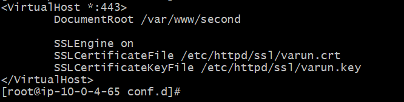
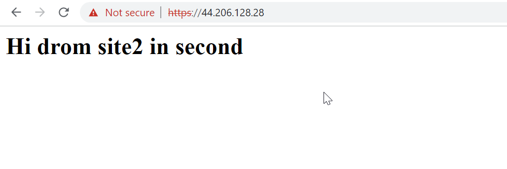

RSA and SHA are two different cryptographic algorithms used for different purposes. **RSA is an asymmetric encryption algorithm, while SHA is a hash function**.

## RSA

RSA is primarily used for **encryption and digital signatures**. It is based on the mathematical problem of factorization, and it uses a **pair of keys (public and private)** to **encrypt** and **decrypt** messages. RSA is commonly used in secure email, online banking, and other secure communication protocols.

For example, if you want to send a secure email to someone, you can use RSA to encrypt the message. You would use the recipient's public key to encrypt the message, and only they would be able to decrypt it using their private key. This ensures that only the intended recipient can read the message.

RSA makes sure the data is encrypted with public key and can be decrypted only with private key which is secured. This is to enable confidentiality.
SHA algorithm is a hash function which is used to generate hash for the data by which it can ensure data integrity.
What it means that it can check whether the initial SHA hash value of source and final SHA value matches.
One example is when you download a file from the internet, you may want to verify that it hasn't been tampered with. You can use SHA to generate a hash of the file, and then compare that hash to the one provided by the website. If the hashes match, you can be reasonably sure that the file hasn't been modified since it was uploaded.

**SHA1SUM** is **160 bit** whereas **SHA256SUM** is 256 bit hash returning command of linux. The higher the number, more it is difficult to decrypt the hash.
The reason is as 160 bit hash can have 2^160 combinations(1 bit can be 0/1) and 256 bit hash has 2^256 combinations, it is much harder to break as it is trillions of possibilites making it hard for attacker.

## Generate Self Signed Certificate Using OpenSSL

`openssl req -x509 -new -nodes -key example.com.key -days 365 -out example.com.crt`

We can use **keyout** flag for specifying location.
`openssl req -x509 -days 120 -nodes -newkey rsa:2048 -keyout/etc/nginx/ssl/self.key -out /etc/nginx/ssl/self.cert`

Meaning of various elements of the command -

**req**: This is the OpenSSL command for creating and managing certificate signing requests.

**-x509**: This option specifies that a self-signed certificate should be generated. The resulting certificate will be a valid X.509 certificate, which can be used for SSL/TLS encryption on a website.

**-new**: This option specifies that a new CSR should be created. In the case of a self-signed certificate, a CSR is not strictly necessary, but OpenSSL still requires it to be created.

**-nodes**: This option generates the private key without encryption. This means that the private key will not be protected by a passphrase.

**-key example.com.key**: This option specifies the file name and location of the private key to use for signing the certificate. In this case, the private key is stored in a file named example.com.key.

**-days 365**: This option specifies the number of days that the certificate should be valid. In this example, the certificate will be valid for 365 days (1 year).

**-out example.com.crt**: This option specifies the file name and location where the self-signed certificate should be saved. In this case, the certificate will be saved to a file named example.com.crt.

